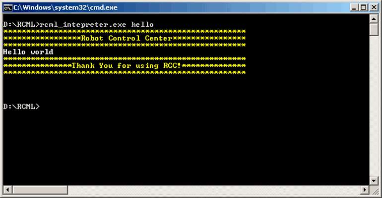
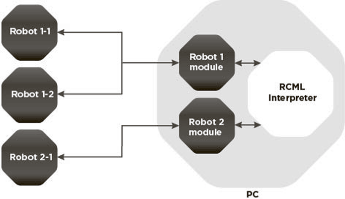
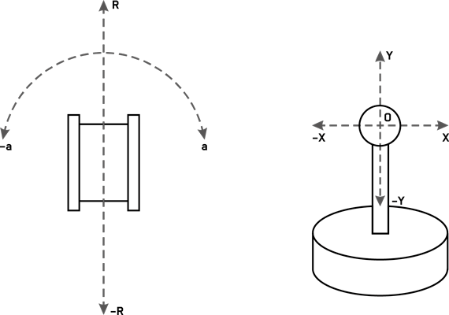
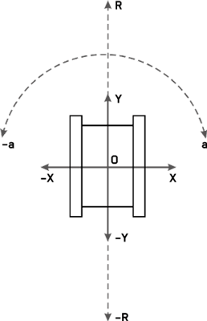

[TOC]

# 1 Installation and Configuration of Compiler and Interpreter
### 1.1 Quick Start

[RCML Quick Start for Windows](https://youtu.be/gSu8K0n8g3Y)

[RCML Quick Start for Linux](https://youtu.be/AdjV8Ruke_Y)

Go to *SourceForge* project page at:

[http://sourceforge.net/projects/rcmlang/files/](http://sourceforge.net/projects/rcmlang/files/)

From the folder of your OS, download the archive with files of *rcml_build_X.zip* compiler and the archive with files of *rcml_modules_build_X.zip* modules, where *X* is compiler version. Versions of these archives must be the same.

Extract both of the downloaded archives to the same folder.

Go to the folder with the files extracted and create *config.ini* file there with the following contents:
```
[robot_modules]
module = test
[function_modules]
[control_modules]
[repository]
[lib_search_paths]
```
In the current folder, create another file called *hello.rcml* with the following contents:
```cpp
function main() {
	robot_test->print("Hello world!\n", 0);
}
```
We are going to create your first program using *RCML* and consisting of a single operator – a function calling output of the line *“Hello world!\n”* of the test virtual robot *robot_test* with a delay of 0 sec.

To compile a program, run the command line editor in the current folder and execute the following command:
```bash
rcml_compiler.exe hello.rcml hello.rcml.pc
```
A file of compiled program hello.pc will appear in the current folder, as shown in the figure 1.


Figure 1 Result of program compilation

To run the compiled program, execute the following command:
```bash
rcml_intepreter.exe hello.rcml
```
Please note that in this case you do not specify pc extension of the compiled program file. The example of successful execution of the program is shown in the figure 2.



Figure 2 Result of successful program execution

### 1.2 Description of RCML Program Generation Process

You can write a program in *RCML* in any text editor, saving it in a plain text file with *.rcml* extension.

*RCML* extension is advisory in nature, in fact, a file can have any name supported by the file system of your OS.

Subsequently, this file is compiled by *RCML* language compiler, while executing a number of procedures to prepare the program for execution, namely:

- Validation of the program syntax;
- Validation of function calls, robots and transfer of parameters;
- Conversion of the program text into the byte code;
- Execution of various modifications to the byte code to speed up its execution and memory utilization optimization.

In case of successful program compilation, *RCML* language compiler generates a file with program byte code, with recommended double extension *rcml.pc (PC – pseudo code)*. A file with the byte code includes binary content with a structure close to machine codes of the processor, executed by its own virtual machine due to certain features of *RCML* language.

The immediate program execution is performed by *RCML* language interpreter, as the name implies, interpreting byte code instructions through an internal virtual machine into real processor commands.

### 1.3 Installation and Configuration of RCML Compiler and Interpreter

The compiler and interpreter are available for downloading from the *SourceForge* project page:

[http://sourceforge.net/projects/rcmlang/files/](http://sourceforge.net/projects/rcmlang/files/)

The compiler and interpreter are two executable files that used to be put into the same folder. Additionally, in the folder you will have to create a text file *config.ini*, which is the *RCML* environment configuration file. The configuration is the same for the compiler and the interpreter.

The list of the connected modules with breakdown on following sections (types of modules) is specified in this file:

- *[robot_modules]* – the section for connecting robots' modules;
- *[function_modules]* - the section for connecting functional modules;
- *[control_modules]* - the section for connecting control modules; 
- *[choice_modules]* – the section for connecting the robot's choosing modules.

The name of the connected module is specified in the *module* property in the section of the same type as the module. If there are several connected modules of the same type, a separate line is allocated for each of them. Modules of a particular type are loaded in the order, in which they were listed in their section.

An example of setting connected modules in *config.ini*:
```
[robot_modules]
module = test
module = fanuc
module = kuka
module = abb
module = smc
[function_modules]
module = math
[control_modules]
module = test
module = keyboard
module = gamepad
module = myo
[choice_modules]
module = avg
```
For modules of all types should be created a folders named accordingly to the section name and placed in the folder with the compiler and interpreter *(robot_modules, function_modules, control_modules or choice_modules)*. For each module, in the folder corresponding to its type, a directory with the same name as the one of the module should be created; this directory will be further referred to as the module directory. The module itself is represented by a dynamic-link library file which should have the same name as the module, but with suffix _*module added*. The module file should be in the module folder. The module folder may contain other files required for module operation, e.g., configuration files.

Additionally, the *config.ini* file may contain following sections:

- *[Repository]* - contains only property * URI * in which the Repository address for receiving *RCML* modules is specified (by default *https://repository.rcml.info/api*).

- * [Repository/Deployer] * - contains data for identification in the Repository, filling of this section is necessary only if you use the industrial version of *RCML* or you are *RCML* developer of modules, is more detailed in the section ["Obtaining the license *RCML*"](#16rcml). Contains the following properties:
	- * UserID * - the user login in the Repository;
	- * Path * - a way to the file of the private key (* \*.key *) which is couple to the public key loaded in a repository.

- *[statisctic]* – this section may have only one property - *db_path* - the path to the database file where the robots will write statistics about the performed functions. If the database file does not exist, it will be created. If the database already exists, it will be amended. If this property is null or empty, no stats will be recorded.

- *[lib_search_paths]* – search paths for the compiled *RCML* libraries. In this section, the path property may specify the default path to the *RCML* library. There may be several paths, in case each path is set via a separate path property. The required library is searched by the specified paths in the same order in which the path in this section have been specified.

- *[locale_settings]* is the section of the current locale settings; it may contain only one property – locale, where the parameters of the current locale for *RCML* are specified as a string according to the rules adopted in the Linux environment. By default, the current locale is English; it is set by value *en_US.UTF-8*.

For example, to switch the current locale to Russian, set it to *ru_RU.UTF-8*.

*Important!* The *locale_settings* option is supported only in Windows OS.

The files of all supported locales available for download from the appropriate directory at the official download page of the *SourceForge* project:

[https://sourceforge.net/projects/rcmlang/files/translations/](https://sourceforge.net/projects/rcmlang/files/translations/)

You can learn more about how to add your own locale to *RCML* project in the locales repository webpage:

[https://github.com/RobotControlTechnologies/RCML_translations](https://github.com/RobotControlTechnologies/RCML_translations)

### 1.4 Details of Robot Modules

Robot modules hold one of the key positions in *RCML* language, because communication and transfer of commands to the physical robot is performed via them, see. the figure 3.



Figure 3 The role of robot modules in communication with the physical robots

Robot module is responsible for sending commands from *RCML* language interpreter to one or more robots of a single class (or type) incorporated by this module. It is recommended to use a separate module for each robot class or type. *RCML* interpreter communicates with the robot module through the declared *API*, and that in turn communicates with each robot assigned to it. Thus, communication and control of a robot by the interpreter is implemented through the robot module, allowing to connect a wide range of robots to it. Read more on how to write your own robot module and connect it to the interpreter in documentation for developers.

Depending on their functionality, robot modules can additionally provide manual robot control by the control device represented by an appropriate module in *RCML* environment.

### 1.5 Details of Function Modules

You can add new features to *RCML* language through function modules that are not appropriate or can not be implemented in this language, for example, any complex calculations. Thus, function modules may allow *RCML* communication with other software through a separate *API*.

### 1.6 Details of Control Modules

Modules of this type are used for making decisions about choosing the next robot for performing a particular function. Alternatively, the choice may be based on previously accumulated statistical data about this function, robot, or the program. Using the choosing modules, it is possible to choose the robot by various different algorithms used in the modules. Usually, a separate module is a separate algorithm for choosing the robot.

Without these modules, the robots are chosen at the discretion of robots modules. Read more about the mechanism of choosing the robot in section ["Using the robot choosing module"](#3-7-using-the-robot-choosing...).

### 1.7 Details of Robot Choice Modules

Modules of this type are used for making decision on a choice of the next robot in need for execution of needed function. Choice can be based on the earlier collected statisticall data about the function, robot or program. With use of robot choice modules it is possible to make a choice of robot based on the algorithms supported by conrecte robot. Usually one module represent one algorithm of a choise of the robot.

### 1.8 Compiling and Running RCML Program

As noted earlier, a program written in the *RCML* language should first be compiled into the byte-code, after which it can be invoked by the interpreter.

For compiling the program, start the *RCML* compiler; by default, the name of its executable (without extension, since it may vary depending on the OS) *is rcml_compiler*. The compiler is to be started with 2 parameters passed to it:
```
rcml_compiler <rcml_text_file> <rcml_pc_file>
```
The first parameter, *rcml_text_file*, is the path to the file with the *RCML* program, and the second parameter, *rcml_pc_file*, is the path to the file into which the byte-code of the program is to be written.

If compilation is successful, the file with the byte-code will be created, or overwritten if it already exists. And now it can be invoked using the *RCML* interpreter, by default, the name of the executable file is *rcml_interpreter*. At startup, the compiler expects a single parameter – the file with the byte-code. The syntax of the command for starting the interpreter:
```
rcml_interpreter <rcml_pc_file>
```
**Important**! The interpreter automatically appends the .pc extension to the *rcml_pc_file* path.

### 1.9 RCML command-line options

The command line of the *RCML* compiler has the following pattern:
```
rcml_compiler [--version] [--logfile log_file_path] [--without-optimization] <rcml_text_file> <rcml_pc_file>
```
- *--version* - shows the current version of the *RCML* compiler, the list of versions supported by the *API* modules, and the build date. If this flag is specified, the compiler shows the information and immediately exits;
- *--logfile log_file_path* - writes the output of the *RCML* compiler to a file in the *log_file_path* part;
- *--without-optimization* - turns off optimization of byte code executed by compiler to considerably increase the speed of compiler when uploading a larage amount of dots from CAM envrironment to *RCML* program (postprocessing).
- *rcml_text_file* is the path to the file with textual representation of the *RCML* program; 
- *rcml_pc_file* is the path to the file that the compiled program is written to.

The command line of the *RCML* interpreter has the following pattern:
```
rcml_interpreter [--version] [--hardware-info] [--logfile log_file_path] [--debug] <rcml_pc_file> [rcml_params]
```
- *--version* - shows the current version of the *RCML* interpreter, the list of versions supported by the *API* modules, and the build date. If this flag is specified, the interpreter shows the information and immediately exits;
- *--hardware-info* - collection of data about the hardware configuration is necessary for obtaining the license, more information in section ["Collection of the hardware information"] (#163)
- *--logfile log_file_path* - writes the output of the *RCML* interpreter to a file in the *log_file_path* part;
- *--debug* - creates a connection to launched *RCML* debugger for debugging and step by step execution of *RCML* programs;
- *rcml_pc_file* is the path to the file with compiled *RCML* program; and
- *rcml_params* is the startup options of the *RCML* program. Read more about interpreter options in section ["Passing parameters to the RCML program"](#9-1-passing-parameters-to-the...).
***

# 2 RCML Program Architecture Basics
### 2.1 Language Alphabet and the Use of Characters

*RCML* alphabet comprises:

1. Symbols used to compile identifiers
   - Latin lowercase or uppercase characters;
   - Arabic numerals 0 to 9;
   - Underscore character «_»;
2. Separator characters:
   - Space character;
   - Tab character;
   - Line break characters;
3. Special symbols – symbols that perform specific functions in construction of various language constructs: + - * / = { } ( ) <> , ; : ~ # @ ! "
4. Composing characters – a group of characters that are seen by the compiler as a unified whole:  ::  ->  ==  >=  <=  !=
5. “Unused” characters – characters that are not included in the set indicated above, but, nevertheless, can be used in comments or to set values of the constants and strings;
6. Reserved words listed in section ["List of the reserved keywords"] (#11-1)

### 2.2 Rules for Identifier Compilation

The identifier is the name for program elements (functions, variables, etc.) freely selected by the programmer:

- The identifier must begin with a letter or underscore character;
- Numbers can be used in the identifier along with the letters starting from the second position;
- The characters input are case sensitive when specifying identifiers;
- Space is a separator and can not be used inside the identifier;
- Reserved words are not allowed as identifiers.

### 2.3 General Structure of Programs in RCML

*RCML* program consists of two key sections: the section of **inclusions** and the section of **functions**.

Example of *RCML* program:
```cpp
// Section of inclusions
include “function.rcml”
include “C:/robot/robot.rcml”

// Section of functions
function sum(a, b) {
	c = a + b;
	return c;
}
function main() {
	s = sum(1, 2);
	echo(“sum = ”,s,”\n”);
}
```
Section of inclusions always goes before the section of functions. Other *RCML* program files with the text that should be included in this program may be specified in the section of inclusions. It can be sets of any functions, additional libraries, etc. However, the section of inclusions may be empty as well.

The section of functions starts after the first mention of function keyword. Main program code is specified in the section of functions, which consists of functions. 

By analogy with *C* and *C++* programming languages, execution begins with a function named *main*, which must be present. This statement refers to executable *RCML* programs (not libraries). More information about libraries available in section ["Creation of libraries files"] (#10rcml)

### 2.4 Inclusion of Additional RCML Files into the Program

Additional files of *RCML* programs are included as follows: each file to be included is written from a new line. *Include* keyword must be placed in the beginning followed by a path to the file to be included in double quotes through the separating character (for example, space character).

Syntax:
```
include “path_to_file”
```
Examples:
```
include “function.rcml”
include “C:/robot/robot.rcml”
include “../libs/robot.rcml”
```
The path to the file to be included can be absolute or relative. In case of a relative path, the compiler first calculates the absolute path to the file relative to the absolute path to the file, where this inclusion structure is found. If the file is not found by the resulting path, the compiler calculates the absolute path relative to each variant of the path from *path* parameter of *lib_search_paths* section in *config.ini* configuration file in the order in which these paths have been specified in the configuration file.

This path parameter from *lib_search_paths* section of the configuration file is called “default search path”. The syntax for specifying default search paths is as follows:
```
[lib_search_paths]
path = path_1
path = path_2
```
The order of inclusion of additional files with the code is the same in which they have been listed in the original .rcml file.

**Important! If non-empty section of inclusions is found in the file to be included, files from this section will be included in the source file immediately after inclusion of the file (right after the line with include word) where they were found.** We can say that instead of *include* construction will be placed a full text of the 

The absolute path is calculated for each included file, and files included again with the same absolute path will not be included in the program.

You should understand a mechanism to include additional files in the program. This is analogous to the fact that instead of *include* structure, the text of the included file is placed in its entirety. The syntax of each file included is checked before inclusion, and the program is compiled taking into account all calculations and optimization only after preparation of the full text of the program considering all the included files.

### 2.5 Including RCML Library Files into the Program

Additional libraries written in *RCML* are included as follows: each library included is written in a new line from *include_lib* keyword in the beginning followed by a separating character (for example, space character), followed by the identifier – library name (to use to apply to the library in the code), and then a separating character and a path to the file with library byte code (pc-file) in double quotes.

Syntax:
```
include_lib library_name “path_to_library_file”
```
Example of the program including math library:
```cpp
include_lib math "../export_library/etalon.rcml.pc"
function main() {
	s = math.sum(1,2);
	system.echo("\n1 + 2 =",s,"\n");
}
```
The process of creating the library is described in Section ["Creating *RCML* Library File"](#10-creating-rcml-library-file).

Library file search process by the compiler is similar to the search of the file to be included. However, the library code is not included into the executable program code. A link to the library file is created in the executable program, and running such a program will also require the file of the library compiled, as in case of compilation.

You can include the same library file under different names-identifiers. 

It should be noted that libraries can have links to other libraries, i.e., when compiling the library, it is allowed to include other libraries in it.

### 2.6 Functions

As noted earlier, the executable program that is not a library must always have a function called *main* (hereinafter the main function). Execution starts from it. It does not matter where the function will be placed: in the source file or in one of the included files. It is important that this function existed and was the only one.

Of course, a programmer can create new functions in addition to *main* function, with names corresponding to the rules for specifying identifiers, and apply to them both in main function, as well as in the others.

New function is specified starting from *function* keyword, followed by the name of the function through the separator, and then the list of parameters in parentheses that can be empty. The list of parameters is followed by a function code – a list of its operators in curly brackets.

Syntax for specifying a function:
```cpp
function function_name(list_of_parameters) {
	list_of_operators
}
```
Example function:
```cpp
function sum(a, b) {
	c = a + b;
	returnc;
}
```
A function in *RCML* language can either return a value or not return it. Values are returned (similar to exit from function) using *return* operator. 

It is optional to specify this operator it the end of the function if the value is not returned. If the function does not return the value, then by default the return value is considered to be zero – 0.0.

Function parameters values are always transferred by value, so they can be used as regular variables in a function body without fear of overwriting data in the parent function where the current one was called from.

The order of the functions with respect to each other is not important and does not affect the scope of their visibility. Each function can be called from any other function, except for the main function. Since execution begins from it, it cannot be called in the code of functions. It is worth noting that a function cannot be declared within the function.

The parameters in the main function *(main)* have a special meaning, see more in Section ["Passing parameters to the *RCML* program"](#9-1-passing-parameters-to-the...)

### 2.7 Comments

Single- and multi-line comments are available in *RCML*. Single-line comment begins with double forward slash // and follows until the end of the line.

Example:
```
//This is a comment
```
Multi-line comments begin with a combination of characters /\* and continues to the following combination of characters \*/

Example:
```
/* This
is a multi-line
comment */
```
### 2.8 Data Types

Explicit and implicit data types are available in *RCML*. The first group includes those data types with variables which can be created and used in various operations. The second group, on the contrary, includes variables which can not be created, but these data types may appear in some implicit operations, or they can be used as parameters for specific functions. Data type for connection with the physical robot is set aside from this classification.

It should be noted, that at this stage of *RCML* development, other data types, including arrays are not yet provided.

#### 2.8.1 Explicit Data Types

There is only one explicit data type in *RCML* – the real numbers. All generated variables used in the operations, parameters and return values of user-defined functions, and also of all functions of modules and robots are the real numbers.

#### 2.8.2 Implicit Data Types

Logical and string types are implicit data types in *RCML* language.

Data used in calculation of logical expressions are forcibly converted to the logical data type.

String data type is used only to specify string constants that can be parameters for the system-level functions (*RCML* system functions, functions of robot modules and functional modules). A string constant is a sequence of any characters enclosed in double quotes, while the following control character sets can be specified in a string constant, deemed a single character:

- \n – word wrap;
- \” – inserting the double quote character;
- \ \ - inserting a backslash.

### 2.9 Variables

A variable in *RCML* language is initialized when you first assign it a value, and it remains visible from the point of initialization to the end of the function body where it is used. A single character “=” is used to assign a value to a variable. Constant values, results of expressions and function calls can be assigned to variables. A variable can be transferred as argument to the function. Variables that are the parameters of the function are initialized when transferring of execution to this function.

Example of using variables in a function:
```cpp
function sum_by_abs(a, b) {
	c = a + b;
	if (c < 0) {
		с = -с;
	}
	return c;
}
```
There are no global variables in *RCML*.

The programmer may not take care of memory consumption, and may not delete the variables used when they are no longer needed. The compiler takes care of it in optimizing the resulting byte code, calculating the life paths of each variable. However, this does not apply to specific variables related to the physical robots.

### 2.10 Expressions and Operations

Expressions in *RCML* can consist of numeric constants, variables and returned function results that can be used as operands of the mathematical and logical operations as part of the expression. Operations, in turn, may be unary or binary. Priority of operations in expressions is given in parentheses, just as it is in mathematics. The result of the expression can be assigned to a variable or transferred as a parameter to a function. It is possible for those function parameters that work with these data types. Using special variables to communicate with a robot in the context of expressions is prohibited at the level of syntax rules.

Example expressions:
```bash
a = 1 + 1;
a – 5;
c = a * b;
d = sum(a, с) * 10 * (a / c);
e = -d + 15;
f = d >= 10;
!f;
```
#### 2.10.1 Mathematical Operations

The following binary mathematical operations are available in *RCML*:

- «+» - addition operator;
- «-» - subtraction operator;
- «*» - multiplication operator;
- «/» - simple division operator;
- «%» - taking remainder of division operator.

And one unary operation:

- «-» - sign change.

#### 2.10.2 Logical Operations

The following binary operations from logical operations are available in *RCML*:

- «==» - checking equality;
- «!=» - checking inequality;
- «>=» - checking greater than or equal to;
- «<=» - checking less than or equal to;
- «>» - checking greater than;
- «<» - checking less than;
- «&&» - conjunction, AND operation;
- «||» - disjunction, OR operation.

And one unary operation:

- «!» - logical negation.

### 2.11 Converting Data Types

By using different types of operations in one expression, expression result data type is implicitly converted to the expected type of the operand of the next operation. The result will be real if it is saved in a variable or transferred as a function parameter, or strictly logical if it is used in a conditional operator.

The following rule applies when converting real type into logical type: 

*if the element is not zero, then the result is true, otherwise – false*. 

The following rule applies in reverse conversion:

*if true, the result is 1.0, if false, the result is 0.0*.

### 2.12 Control Structures

*RCML* provides a standard set of structures affecting the progress of the program execution. They can be divided into conditional, cyclic and unconditional.

#### 2.12.1 Conditional Control Structures

*RCML* has only one conditional transfer operator – *if*. Its syntax is as follows:
```
if (expression) {
	//set of operators, if the result of expression is true
} else {
	// set of operators, if the result of expression is false
}
```
The result of expression in parentheses is reduced to a logical type, and if the result is true, then the first block of operators in curly brackets is executed, otherwise – the second block of operators following *else* keyword. The second block of operators with *else* keyword can be omitted when specifying a conditional operator.

#### 2.12.2 Cyclic Control Structures

Cycle (loop) operator in *RCML* is also unique. It is loop operator. It is a simplified cycle operator in comparison with similar operators in traditional programming languages. It is unconditional, and its block of operators will be executed endlessly, unless it has an appropriate exit structure with prerequisite or without it. The syntax of loop operator is as follows:
```
loop {
	// set of loop operators
}
```
#### 2.12.3 Other Control Structures

Other control structures in *RCML* are operators of unconditional transfer. When reaching them, the program goes to a particular section.

The operator of transfer to the beginning of the cycle – *continue*. When it is reached, the program goes to the beginning of the current cycle. It is used without parameters.

The operator of loop exit – *break*. When it is reached, the current loop is interrupted. It is used without parameters.

The operator of function exit – *return*. It may be used both with an expression, and without it. In the first case the result of the function will be the result returned by the expression. In the second case, the function will return the default value of 0.0.

The syntax of *return* operator with expression return:
```
return expression;
```
Without expression return:
```
return;
```
Examples of return operator:
```
return 2+2; //function exit with expression return
return; // function exit without expression return
```
If a *return* operator is specified in the *main* function, its implementation will lead to termination of the *RCML* program, and the value passed via this operator will be passed to the OS as the program exit status. However, the passed value will be rounded to integer by dropping the fraction part.

The operator exiting the program – *exit*. When it is reached, the program stops executiong regardless of function where it is specified. This operator (like *return*) may be called both with an expression, and without it. In the first case, the result of the expression is returned to the OS as the exit code of the program, in the second case the exit code of the program is considered to be equal to 0.

The syntax of exit operator with expression return:
```
exit expression;
```
Without expression return:
```
exit;
```

### 2.13 Exceptions

In *RCML*, it is available to handle exceptions occurring in a particular block of code, as in some other programming languages. General type of exception handling structure begins with *try* operator, then it is followed by a block of operators, where an exception can occur in execution of the operators of this block, then it can be followed by catch operator, and a block of operators to be executed in case of an exception. General type of exception handling structure is as follows:
```
try {
	//block of operators, where an exception can occur
} catch {
	//block of operators to handle the case with an exception
}
```
When an exception appears in *try* block, the program goes to catch block operator. It should be noted that *catch* operator and its block may be omitted, and then the program goes to the operator following the block of *try* operator. Exception handling structure may be nested in another one, and, in case of an exception, it will be handled by the current structure.

Exceptions may occur when executing various functions provided by external or system *RCML* modules, such as function modules or robot modules, but an exception can be called manually using throw operator. When executing this operator, an exception will immediately be thrown.

Work of the mechanism of exceptions as an example of a simple program for division of numbers:
```cpp
function main() {
	try {
		echo(“this simple division program\n”);
		echo(“c = a / b \n”);
		try {
			echo(“input a\n”);
			a = input();
			echo(“input b\n”);
			b = input();
			if (!b) { // if b is zero, division cannot be executed
				throw; //throw an exception
			}
			c = a / b;
			echo(“c = ”, c, “\n”);
		} catch {
			echo(“b is zero!”); //exception will be handled in this block
		}
	} catch {
		//this block will never be executed
	}
}
```
However, in *RCML*, focused on robotics, unlike other programming languages, *try* operator can have parameters that specify exactly how it should work. The first parameter of *try* operator is a string constant specifying the mode of operation. The second parameter of real data type may be given depending on the specified mode.

Try operator has three modes of operation:

- “error_default” – default mode of operation as a common *try* operator. In this case, the second parameter is not specified. If the parameters of try operator are omitted as in the above example, then *try* operator operates in this mode.
- “error_time_limit” – mode of operation with a countdown of time limit in which a block of code of *try* operator should be executed. In this case, the second parameter is given to specify the number of milliseconds limiting execution of the block of code of *try* operator. If this block is not executed within the specified time, an exception will be thrown. If an exception is thrown earlier, the countdown will be stopped, and the exception will be handled normally.
- “error_try_count” – mode of operation with a count of the number of attempts to execute the block of *try* operator. In this mode, the second parameter takes a number of allowed attempts to execute the block. In each thrown exception, the count of the number of attempts in *try* operator block will be reduced by 1, and if it reaches zero, the exception will be handled normally.

Despite the fact that try operator may take the parameters, it is not a function and does not returns a value.

Example of using the above modes to handle success of robot performance of its function giving it three attempts with a time limit of 2 seconds for each:
```
try(“error_try_count”, 3) {
	try(“error_time_limit”, 2000) {
		robot->do_something();
	} catch { //if time is out
		throw; //then throw an exception to end the attempt
	}
} catch {
	//this block is executed when all attempts are ended 
	//with no result obtained
}
```
Using the *throw* operator, the exception may be used for passing some value (exception value). In this case, the syntax of the *throw* operator will be the following:
```
throw expression;
```
For processing the value of the thrown exception, the try operator will have a slightly different syntax: the parameters of the *catch* operator should specify the identifier, i.e., the name of the variable to which the exception will be written:
```
try {
	//the block of operators in which the exception may occur
} catch (variable_name) {
	//the block of operators for handling an exception
}
```
If at the time of exception the specified variable does not exist, it will be created, otherwise it will be overwritten.
```
try {
	throw 3;
} catch (E) {
	system.echo(“E = ”, E, “\n”); //will show E = 3
}
```
The variable, to which the value of the exception will be written, will be available in the *catch* block and beyond it till the end of the function.

An example of creating the variable:
```
system.echo(“E = ”, E, “\n”); //error E does not exist yet
try {
	throw 3;
} catch (E) {
	system.echo(“E = ”, E, “\n”); //will show E = 3
}
system.echo(“E = ”, E, “\n”); //will show E = 3, since E has been created in the catch block
```
An example of overwriting the value:
```
E = 5;
system.echo(“E = ”, E, “\n”); //will show E = 5
try {
	throw 3;
} catch (E) {
	system.echo(“E = ”, E, “\n”); //will show E = 3
}
system.echo(“E = ”, E, “\n”); //will show E = 3
```
In this way it is possible not only to process exception values passed via the *throw* operator, but also to process exception values passed from functions of robot modules and functional modules, and libraries.

Example:
```
try {
	robot_test->throw_value(10);
} catch (E) {
	system.echo(“E = ”, E, “\n”); //will show E = 10
}
```
If the thrown exception has not been intercepted in the *RCML* program, the *RCML* program will terminate with code 1, i.e., an error, which may be a communication tool between the OS and the *RCML* program (read more in Section ["Communication with the OS"](#9-communication-with-the-os)). In this case, the value of the exception will be lost. 

### 2.14 Calling Functions

*RCML* language functions can be internal or external.

Internal functions refer to the functions described in *RCML* language in the current file of program source code or in included files with the source code in *RCML*. The code of these functions is within the current program and will be compiled into an executable file of the current program.

External functions refer to the functions of *RCML* libraries already compiled, linked to the current program or the functions of functional modules, i.e., the code of these functions is outside the current program in *RCML*.

Syntactically, internal functions in *RCML* are called in the same manner as in other programming languages. You must first specify an identifier – the function name, and then a list of arguments given to it in parentheses:
```
identifier(argument1, argument2, argument3)
```
The result of any function call can be assigned to a variable or used in the expression. It should be noted that in the function call, all parameters specified in its description should be transferred through arguments, except for some *RCML* system functions.

Calling an external function has a different syntax:
```
source_name.function_name(argument1, argument2, argument3)
```
An identifier (name) of the library linked from the section of inclusions is used as the source name, or the name of the function module specified in the configuration file. Description of names and arguments of external functions can usually be found in the documentation for the respective source – the library or function module.

It should be noted that when searching for the external function, the desired source is in the first place sought among linked libraries and then among linked functional modules. If the source is found, the desired function is sought in it by name, if the function is found, the number of function parameters declared in the source is checked against the number of arguments transferred by the user. If the number of arguments and parameters is the same, it is believed that the desired function is found. In any other case, an error is issued.

*RCML* has *system* module, always available in the program and providing system functions of *RCML*. If this name is specified as the source of external functions, the function is searched directly in this module, ignoring the libraries with the same name.

### 2.15 System Functions in RCML

System functions in *RCML* are available in *RCML* environment via *system* module. These functions are accessed in the same way as the external functions of the module, specifying “system” name.

The system module has the following functions:

- *system.input* – a function of reading a number from a string resulting through standard input. The line read should consist of digits and optionally of the sign + or -. Then, it is converted to a number, which is returned as a result of function call. This function has no parameters.
- *system.echo* – a function of data output transferred as arguments to the standard output. It can have any variable number of parameters including the numbers and string constants.
- *system.set*  – a function of change in *RCML* environment system parameters. It has two arguments: the name of a system parameter and its new value. The name of a system parameter is defined by a string constant, and the new value of this parameter depends on the system parameter specified. Now there is only one system parameter in *RCML* environment:
  - *"behavior"* – function execution behavior by default. The second parameter is the mode flag, character ~ or #. See Section ["Batch Data Transmission to Robots"](#8-batch-data-transmission-to...) for details about execution modes.
  - *"priority"* - a priority of robots usage in current function. The second parameter of a fuction is a real number, the bigger the value the higher priority of a function in case of robot usage.
- *system.sleep* – a temporary pause in the program execution process. It has one numeric parameter – the pause time in milliseconds.
- *system.hand_control* – enabling manual control for a robot. This function transfers the robot in hand control mode by the said control module. Execution of the main program for the period of hand control is suspended. This function has a variable number of parameters:
  - First parameter – a special variable associated with the appropriate physical robot. Mandatory parameter;
  - Second parameter – a string constant – control module name. Mandatory parameter;
  - Third parameter – a string constant - robot axis;
  - Fourth parameter – the name of control device axis as a string constant or an expression that will set the values for robot axis specified in the previous parameter.
  - Fifth and sixth, seventh and eighth, etc. parameters are always set in pairs: robot axis and the source of values for it.
- *system.send_package* – a command to send the accumulated command package to robots. The only parameter is the flag for the mode of execution of commands from the package, ~ or #. Read more about this function in Section ["Specifying Function Execution Modes"](#6-specifying-function-execution...).

### 2.16 Macros

*RCML* supports macros. A macro is a combination of an identifier – macro name – random text –macro contents. The macros are declared in the section of declarations by *define* keyword, followed by a separator, followed by an identifier (macro name), a separator again and macro text.

Macro syntax:
```cpp
define macro_name macro_contents
```
All occurrences of the macro name in the text of the section of functions will be replaced by its contents. After defining a macro can not be re-defined by other macros.

The macro content includes any text between the separator character following the macro name and the line end. Macros can have multi-line content (use «\» character, i.e., shield the line end, as it is done in multi-line macros in *C++*). Then the macro content will be considered as the text until the end of the line following the line ending with this character. Line feed characters in multi-line macros are preserved.

Example use of macros
```cpp
define ONE 1
define TWO 2
define TREE ONE + \
TWO
define TEST_MS "test message"

function main(){
	system.echo("1 = ",ONE,"\n");
	system.echo("2 = ",TWO,"\n");
	system.echo("3 = ",TREE,"\n");
	system.echo("Test print > ",TEST_MS,"\n");
}
```
This text after macros processing will be converted to the following text of the program:
```cpp
function main(){
	system.echo("1 = ",1,"\n");
	system.echo("2 = ",2,"\n");
	system.echo("3 = ",1 + 
2 ,"\n");
	system.echo("Test print > ","test message","\n");
}
```
The resulting text will already be compiled into the byte code. The result of this program will be as follows:
```
1 = 1.000000
2 = 2.000000
3 = 3.000000
Test print > test message
```

**Important! It is dangerous to use macros, which recursively refer to each other. In this case, an infinite recursion occurs, which will cause the compiler crash. At this stage of language development, closed recursion in macros cannot be found.**

Example closed recursion:
```cpp
define ONE TWO
define TWO ONE
```
***

# 3 Features of Program Interaction with Robot

As noted above, *RCML* language is focused on robotics and has rather poor components as a programming language, since it is not intended to create general-purpose application software and is aimed at interaction with robotics, allowing to achieve new results in this regard.

### 3.1 Robot Concept in RCML

A robot in *RCML* is a kind of executive resource that can be engaged to perform a specific task (function) and then released for re-engagement, but in another task for example. The immediate analogy is processing core of *CPU*, which can be engaged in only one process at a particular time. However, *OS* means allocating very small quanta of *CPU* time to different software processes or tasks, can create the illusion that one core handles multiple tasks. In *RCML*, the robot as a resource is controlled by the interpreter, but the robot is engaged not for a period of time, but to perform a specific function or multiple functions, and thus the time of its engagement may be different.

A robot is an object of the real material world, and its actions are often not as instantaneous as in the above analogy with the *CPU* core. And it takes time to perform its function, and this time may be different for the same function as a robot is affected by many factors of material object world.

A robot module as such provides *RCML* environment with robot class description assigned to it. It is assumed that locally in the object world where *RCML* is used, maybe one or more robots of the same class assigned to one robot module. And there are two key types of objects as part of the robot module in *RCML* environment, as shown in Figure 4:

- Robot module acts as a controller for robots of the class entrusted to it, i.e. selects a free robot to be engaged and released after work;
- Robot representation – a reflection of a specific physical robot in a virtual *RCML* environment, translating commands to the physical robot.


Figure 4 Virtual representation of objects classes in *RCML* environment

It should be noted that many robot classes may be connected simultaneously, i.e. many robot modules, and each of them can provide access to multiple robots in its class. Robots within the same class must be completely identical, both in physical and functional performance.

### 3.2 Using Robots in the Program

For the robot to be used in the program, its class and function should be specified. The class name of the robot coincides with the name of the robot module in the config.ini file. However, the class of the robot in the *RCML* program should be specified using keyword robot and an underscore. 

The syntax for activating the robot:
```
robot_class_of_robot
```
For example, you can call the robot from module test, and then its class will be identified as:
```cpp
robot_test
```
Meeting the class name of the robot in the text of the program, the system will send a request to the appropriate module of the robot and will stop program execution until it finds a free robot of the required class.

### 3.3 Calling Robot Function

After receiving the robot of the required class, the programmer can make him perform the requested action, i.e., cause the execution of a certain robot function. Robot functions are programmed by the robot developer together with robot module and are described in the documentation to robot module.

Calling a function is visually similar to the object method call in *C*-like programming languages. Robot class must be specified, and then through the pointer character “->” the required function is specified, and then goes the list of arguments to this function in parentheses. 

Robot function call syntax:
```
robot_robot_class->robot_function(arguments);
```
For example, you should call do_something function with one argument 1000 from *test* class robot:
```cpp
robot_test->do_something(1000);
```
Reaching such structure, the interpreter will reserve a robot of this class, waits until the real physical robot is engaged and then sends a command of robot representation of the execution of the specified function with the specified parameters. After function execution, the robot will be automatically released and transferred to free status.

It should be noted that when robot function call is specified this way, the interpreter waits for confirmation of the function from robot representation, and only then continues executing the rest of the program. Read more information about flags of function execution in Section ["Specifying Function Execution Modes"](#6-specifying-function-execution...).

Depending on how and where the execution of robot functions is described, they (functions) can be divided into three types:

- User-defined functions – the functions described in *RCML* in the current file of the source program code or in the included files with the source code in *RCML*. The code of these functions is within the current program and will be compiled into an executable file of the current program;
- Library functions – the functions of *RCML* libraries already compiled, linked to the current program, i.e., the code of these functions is outside the current program in *RCML*;
- System functions – the functions that are provided to *RCML* environment by robot module. The execution code of these functions is in robot module or in robot software.

System function can be re-defined by user-defined and library function. Library function can be re-defined by user-defined function only. User-defined function can not be re-defined. When you create two user-defined functions with the same name, the compiler will generate an error. This mechanism allows you to re-define inefficient functions of the level, where it is more difficult to do, to the functions of the level, where it is easier to do. For example, it may be difficult to recompile robot module or library due to the absence of source codes, however, it is easy to re-define the required function in the text of your program.

Thus, in a function call, the specified robot function is first searched among user-defined functions. In case the required function is not found among user-defined functions, the search continues among library functions. Each library is searched for the required function in the order it is included in the source program code. It should be noted that different libraries may include th same function for the same robot, so the first function found will be selected. If the required function is also not found among library functions, the search continues among system functions. There may be multiple system functions with the same name as part of robot module, but the first function found is always selected. If the required function is not found among system functions, then an error is generated.

The function is searched only by its name without taking into account the number of its parameters. If the function found has a number of parameters other than the number of arguments sent in the function call, an error is generated.

Based on this search algorithm, it can be concluded that user-defined functions have a highest priority in the search, followed by library and then system functions.

However, sometimes a programmer faces the need to use system function, which is re-defined by library function. This case is possible when library function implementation is inefficient, the source code of the library is absent, and there is the need to use this library because it includes other functions. It is possible to directly access system function if you include a dot character “.” before the function name. Function call syntax is as follows:
```
robot_robot_class->.robot_function(arguments);
```
the above example is as follows:
```cpp
robot_test->.do_something(1000);
```

### 3.4 Working with a Certain Robot

It is often necessary to call multiple robot functions, and they must be performed by a single robot as a predetermined sequence of actions. If the required sequence of functions is called as described above, in case of robots of several classes it is likely that the specified functions will be performed by different robots. If there is a single robot of a given class available, it every time will be engaged and released for each function.

The most effective and rational is to engage a robot once and send commands to it as necessary and then release it, thus implementing a session of robot operation. This requires engaging a robot of the required class and remembering connection to a specific robot engaged. This can be done by saving the robot in a special type of variables with *“@”* character before the identifier. For example, we engage the robot of test class, and save connection with the specific robot in *@r* variable:
```cpp
@r = robot_test;
```
Reaching such a structure, the interpreter, as in case of a robot function call, will send a request to engage the robot, but now the robot will not be released until the command to release this certain robot is reached.

Now, to call the function of this engaged robot, we need to call the function by applying to this variable, not to the robot class. For example, calling the same *do_something* function of this robot with the same parameters:
```cpp
@r->do_something(1000);
```
After performing this function, the robot will remain engaged, and we can call the next function of this robot.

It is not allowed to use specific variables with *@* character in the context of *RCML* expressions. They can not participate in operations, comparisons and be transferred as arguments to functions (except for *hand_control* system function). However, a robot can be assigned to another variable of the same type, i.e. communication with the engaged robot can be saved in several variables, for example:
```cpp
@r = robot_test;
@r2 = @r;
@r4 = @r3 = @r2;
```
As a result, all variables *@r, @r2, @r3* and *@r4* will be attributed to the same robot.

The variable already attributed to a specific robot can be assigned with a pointer to a completely different robot, or even a different robot class:
```cpp
@r = robot_test;
@r2 = @r;
@r = robot_tarakan;
```
Now *@r* is attributed to a robot of tarakan class, and *@r*2 is attributed to a robot of test class. Note that when you change the robot which the variable is attributed to, the robot which it was attributed to previously, **will not be released**.

### 3.5 Releasing the Engaged Robot

A robot “saved in the special variable” can be released using a special delete operator, when it is required. This operator must be accompanied by a special variable that holds a pointer to the robot to be released. Example of robot release with a pointer previously assigned to a variable *@r* is as follows:
```cpp
delete @r;
```
It should be noted that all robots involved and not released using delete operator, will be released at the end of the function execution only, where they were engaged. This statement does not apply to robot functions written in *RCML*, because these functions are executed in the context of a robot instance, and a robot instance be engaged in them. Read more about these functions in Section ["Writing Own New Functions for Robots"](#5-writing-own-new-functions-for...). 

**Remember that, by analogy with traditional programming languages where the programmer can allow a memory leak, you can now allow a robot leak in *RCML* **.

[Section "Features of Function Execution by Robots in Different Modes"](#7-features-of-function...) also contains important additional information about the mechanism to release the robot engaged.

### 3.6 Automatic Robot Selection

One of *RCML* features is automatic robot selection for a certain task. To use this feature, just specify robot keyword instead of a specific robot class where it is required to specify robot class: robot function call or assignment a robot to a variable. For example:
```cpp
robot->do_something(1000);
@r = robot;
@r->do_something();
```
Using only robot keyword instead of the full robot class name will be further called the abstract robot.

When using the abstract robot in a function call, *RCML* environment will automatically check what robot types from robots available in the system have this function with this number of parameters, and, if they are available, it will generate a list of candidate robot classes that can be used in the function call. Thus, not only different robots within the same class can be engaged in this function call, but also robots different by classes.

In case of using a special variable for communication with the abstract robot, *RCML* environment analyzes each function call with respect to this variable, and makes a list of candidates only of those robot types which have all called functions with respect to this variable.

### 3.7 Using the robot choosing module

In the method of robot activation described in section ["Using Robots in the Program"](#3-2-using-robots-in-the-program), specific physical robot, or rather the associated robot representation is chosen by the robot module, which may know nothing about the context of using the activated robot, and therefore it is likely to make not the best choice of the robot. Most often, the first available robot within a specific module of robots is called this way if a specific required class of robots had been specified. Or, if an abstract robot had been called, it would be the first free robot from the first module of robots with unused robots, in the order in which the modules of the robots are listed in theconfig.ini file.

If in the process of the *RCML* interpreter operation the option to record statistics (see section ["Installation and Configuration of *RCML* Compiler and Interpreter"](#1-3-installation-and...)) was activated, the statistical information about robots operation and the speed of executing their functions is collected. Some modules of robot choise work correctly only with enabled option of statistics recording. For more about data collection, see Section ["Working with *RCML* statistics"](#14-working-with-rcml-statistics). 

Connecting one or several choosing modules is specified in the robot manipulation the operator in angle brackets <>, where all choosing modules are listed, comma-separated. The syntax of this construction is as follows:
```
robot_class_of_robot<list_of_choice_modules>
```
An example of connecting choosing module *avg* to choosing a *tarakan* class robot:
```
robot_tarakan<avg>
```
In this case, the *tarakan* robot module will request all physical representations of the available robots, and their list will be passed to choosing module *avg*. From the provided list, the choosing module will choose the most appropriate robot, which will be used. The choice algorithm is determined by the choosing module.

It should be noted that choosing a robot using a choosing module usually takes longer than without the one, since the module has to perform additional actions associated with decision-making (statistics database queries, etc.).

If the robot chosen by the choosing module has become engaged in another process, the choice procedure starts again, querying the robot module for available robots.

The choosing module may be also indicated in case of using an abstract robot. For example, indication of statistics module *avg*, with abstract robot:
```
robot<avg>
```
In this case, *RCML* get a list of all presentations of the available robots from all robot modules matching this call. From the list of robots representations, only one robot of a particular class will be chosen.

In case several choice modules were indicated for robot initialization. For example: 
```twig
robot_tarakan<test1, test2, test3>
```
In this case, every choosing module will get a list of representations of the available robots, out of which each module will choose one robot. In this case, the order of modules indication determines the sequence of decision-making by the modules, as well as the priority of the robot chosen by a particular choosing module, which may be expressed in points. The first specified choosing module will be the first to select a robot, and the robot selected by it will have the maximum priority in points that will be equal to the number of the specified choosing modules. Accordingly, the last specified module will be the last to make decision, and the robot it chooses will have the priority equal to one point. If the choosing modules choose for activation different robots from the list of the available robots, the robot with the highest points will be activated, i.e. the robot with the highest priority. If the robots chosen for activation have the same points, the robot chosen by the first choosing module will be selected. 

It is important to note that a situation is possible where a specific statistics module for any reason cannot make the decision about choosing a robot. In this case, the module notifies the *RCML* environment, and environment's current behavior is determined as though this module has not been specified for robot activation.
***

# 4 Hand Control Mode
### 4.1 General Information

*RCML* environment can provide capability of hand robot control by means of a certain control device when calling *hand_control* system function with the appropriate parameters.

The basic operating principle of *RCML* environment when switching to hand control mode is to match robot axes along which it can somehow move, with control device axes along which this device can detect changes, see Figure 5. 



Figure 5 Example robot axes and control device axes

This example includes a robot crawler (shown to the left), which can move into its new absolute position of the plane through a series of changes in its position along two axes: *R* axes of movement (forward or reverse) and A axis of rotation A (left or right). And there is a simple control device (a joystick) (shown to the right) which can be deflected in the plane from its initial position along two axes – *X* and *Y*. Accordingly, by means of *RCML*, you can relate joystick and robot axes so that joystick deflection results in robot movement. For example, joystick deflection along Y axis in the positive direction causes movement forward, and joystick deflection along X axis in the negative direction causes robot turn to the left. Let’s assume that this robot is specified in *RCML* environment with tarakan module, and the joystick, respectively, with joy control module. *RCML* code to link them in hand control mode to obtain the above effect, is as follows:
```
@r = robot_tarakan;
hand_control(@r, “joy”, “R”, “Y”, “A”, “Y”);
```

### 4.2 Value Transfer Principle

Thus, control device axis is a source of values, and robot axis is a receiver, and the robot itself is the executive device. Of course, the scale of values or ranges of robot and control device axes may not coincide. *RCML* environment automatically brings the values from control device axis to the range of the values of robot axes, maintaining their ratio.

*RCML* environment gets information on robot axes and the ranges of their values through *API* from robot module, and thus they must be declared to the documentation for this module, in order for *RCML* programmers to use them. Similarly for control devices.

This principle can be extended not only to real axis of movement of a robot or a joystick, but to all its functions, which anyhow can have values and change robot status in real time (within the OS capabilities) for example, turning on light indicators, blocking robot movements, etc. The only requirement is that they must be declared in robot module and documentation to it.

Additionally, you can create the so-called discrete axes, which take a small range of values, and each value may correspond to some status of the robot or its mechanism. A special case is – “binary” axes producing or having a value of 0 or 1, similar to “on” or “off”. A striking example may be an ordinary computer keyboard with 101 keys and, respectively, 101 binary axes. In case of a robot, such axis can be switching on of lamps and lights, or making some sound or enabling voice communication mode. Variations are limited only by imagination of designers of robots and control devices, as well as programmers in *RCML*, which can link the axes of certain devices in any order. Due to the fact that values can be brought to integers, it is possible to link binary axes of both robot and control device with “non-binary” axes of a certain device.

It is important to note that *RCML* environment has no control over the frequency and variability of transfer of values from control device to the robot. If control device each time sends axis value, then even if it has not changed, this value will be transferred to the robot each time. Module developers are recommended to take this factor into account. In certain cases, developers of modules for control devices should pay attention to the factor of value transfer frequency, because each transfer reaches the robot, and it should have time to respond. Developers of modules for robots are recommended not to lose sight of the fact that it is possible to transfer a series of the same values for a given axis only because it (the series) was transferred by control device.

### 4.3 Recommendations on Robot Axis Selection for Hand Control Mode

This section is addressed to developers of robots and robot modules for *RCML* environment. When selecting robot axes to control, one should remember of the so-called “alpha-5” problem true for industrial robots using six-axis kinematics, when a minor robot movement in Cartesian coordinates is accompanied by a significant movement in the coordinates of motor axes. And often it is true for the fifth axis of robot motor, whence the name. However, the principle of this problem can be extended to a fairly wide range of robots, including even such a simple robot crawler as described above.

This principle states that a minor change in the target value of the axis along which the robot must take a new position, should cause proportional small changes in the axes of rotation of robot motors and units, possibly causing only one phase of operation of motors involved in one direction, that is, the same motor does not re-accelerate and re-decelerate.

Otherwise, abrupt accelerations of robot parts and mechanisms are possible, and small changes suggest greater frequency of their occurrence and ultimately it can cause excessive wear and even robot failure or damage to objects of its environment and people.

In the above crawler robot example, this principle is observed. However, if we violate it, and for robot axes select, for example, standard Cartesian X and Y axes describing the plane in which the robot moves (see Figure 6), we can get a number of negative effects.



Figure 6 Example of robot axes selection

For example, a minor positive change in X axis in the current position would require the robot mechanics first to turn the robot to the right for a quarter turn and then move it forward. Each motor would have to perform two operation sessions, one for turn and one for movement, and right track motor would have to change the direction of rotation after the turn, which significantly increases the time when the robot executes the command received and, therefore, reduces robot response speed.

Additionally, selection of such axes of motion for the robot leads to uncertainty, since the robot can move to the new position in different paths:

- Make a quarter turn right and move forward;
- Make a three-quarter turn left and move backward.

In this case, the path selection algorithm is required for the robot, which should be executed whenever a new axis value is received, and each time consuming portion of the CPU time, increasing the robot response speed.
***

# 5 Writing Own New Functions for Robots

Writing own functions for the existing robots is one of the features of *RCML* language. However, it should be noted that according to the canons of programming, new functions should be based on those provided by robot developer through robot module for *RCML* language. This feature is very useful for standardizing names and parameters of the same functions and robots for its subsequent use through the abstract robot. And if robot developer foreseeingly left the access to low-level functions of the robot through robot module, it is possible to expand high-level robot functionality.

### 5.1 Writing Functions for a Certain Robot Class

Specifying a new robot function starts with function keyword, followed by robot class name for that function after the separator, followed by “::” character, followed by the name of the new function and then the list of parameters in parentheses that can be empty. The list of parameters in curly brackets is followed by function code – a list of its operators. The syntax for specifying a robot function:
```cpp
function robot_class::function_name(parameter_list) {
	operator_list
}
```
Example of a new *sum* function for the type of test class robot:
```cpp
function robot_test::sum(a, b) {
	c = a + b;
	robot->do_something(c);
	returnc;
}
```
Specifying a robot function is very similar to specifying a common function in *RCML*, but the execution of such function has a number of significant differences.

The key difference is that a robot function is executed in the context of a particular robot instance and its class. Therefore it is impossible to access the other robots and thus the use of robot classes is prohibited. To access the robot for the function executed, the abstract robot is used (third line of the above example). Of course, all robot functions called via the abstract robot as part of this function must be present in this robot class, that is, they must be provided by robot module, or they must be described in the libraries linked, or in other functions in the source code of the program.

In case there is no access to the robot (attributed to the function) in this function, a real physical robot of the specified class will still be reserved for this function.

In the robot function, you can change modes of execution of other robot functions by conventional methods. For more information about modes of function execution and methods to change them, see [Section "Writing Functions for a Certain Robot Class"](#6-specifying-function-execution...).

### 5.2 Writing Functions for Multiple Robot Classes

Specifying a new function simultaneously for multiple robot classes is similar to specifying a new function for a single robot, except that the required robot classes are separated by commas. Example of specifying such a function simultaneously for two robot classes – *test* and *tarakan* – is as follows:
```cpp
function robot_test, robot_tarakan::sum(a, b) {…
```
Robot classes given for this function must include all functions called through the abstract robot within this function, otherwise this new function is contradictory and inapplicable to a specified set of robot classes.
***

# 6 Specifying Function Execution Modes

Functions written in *RCML*, may be executed in two basic modes:

- Waiting to execute the function – in this case, after reaching a function call command, the interpreter just goes to the beginning of the function called and consistently executes its code;
- Not waiting to execute the function – in this case, a subsidiary thread runs that starts to execute the code of the function called. Execution of the function where the call was generated, continues from position following the call.

In case of “Not waiting to execute the function”, the thread generated can be transferred to a separate processing core by the OS means, and thus causing the effect of parallel *RCML* code execution.

By default, all functions are called in “Waiting to execute the function” mode. This mode is the default mode. You can change function execution mode in several ways.

The first method includes the use of mode flags. Each of them is one character. There are always two characters as the types of modes:

- \# - A flag of function execution with waiting;
- ~ - A flag of function execution without waiting.

A mode flag must be specified at the function call before the function name. Examples of use:
```cpp
~do_something(1000);
#do_anything(1000);
```

The second way to change the mode of the function execution is to use set system function specifying *“behavior”* string constant as the first parameter, and the mode flag # or ~ as the second parameter. Calling this function with these parameters re-defines the default function execution mode, that is, if the mode flag is not explicitly specified in the function call, the function will be executed in the mode specified by the second parameter of set function. Example of set function use:
```cpp
set(“behavior”,~);
//all subsequent function calls will be executed
//without waiting for completion
do_something(1000);
do_something(1000);
do_something(1000);
//mode does not change, because the flag is the same as the default value
~do_something(1000);
//explicit mode change, but only for this particular function call
#do_something(1000);
```
It should be noted that a function can not be called in a mode without waiting for execution, if the result of its call is used anywhere – for example, is saved in a variable or is involved in the expression. In this case such function will be forcibly called in a mode with waiting for execution, regardless of the default mode settings. Placing a mode flag before the function call with used result is prohibited at the level of syntax rules, i.e., in attempt to execute the below example, the compiler generates an error:
```cpp
function sum(a, b) {
	return a+b;
}
function main() {
r = ~sum(1,2);
}
```
System functions (from system module) except send_package function, which will be described in detail in the below Section ["Features of Function Execution by Robots in Different Modes"](#7-features-of-function...), are always executed in “Waiting to execute” mode and ignoring the mode flags before the function call.

If some function is called without waiting to execute, i.e., becomes executed in parallel, the values of the execution mode by default as part of this function remain “Waiting to execute”, i.e. all functions called in it are executed with waiting in its thread, unless mode change is explicitly specified using methods discussed above.
***

# 7 Features of Function Execution by Robots in Different Modes

Before considering the modes of function execution by robots, we must understand how the commands are sent for robot representation in *RCML* environment, which in turn sends the commands to a physical robot. Sending commands to the physical robot is the responsibility of robot module, and sending commands to robot representation is the responsibility of *RCML* environment. Each robot representation has a queue of commands. When the interpreter calls the robot functions, this queue is filled with commands indicating the required functions to be executed. Robot representation reads the commands in sequence, sending them further to robot module. The next command will be read only after robot module reports on completion of another function. In this case, the commands may be sent to robot representation by *RCML* environment in two basic modes:

- Waiting to execute the function – when calling the robot function, *RCML* interpreter puts a command in the command queue of robot representation and waits for its response on completion or failure to complete this particular command;
- Not waiting to execute the function – in this mode, *RCML* interpreter also puts a command in the command queue of robot representation, but does not wait for report on completion and continued execution of the main program.

Obviously, modes of function execution by the robot coincide with modes of function execution in *RCML* environment, therefore, modes of function execution by the robots can be controlled by the same means as used for control of modes of function execution by *RCML* environment.

Example of mode flag use:
```cpp
~robot_test->do_something(1000);
#robot_test->do_something(1000);
@r = robot_test;
~@r->do_something(1000);
#@r->do_something(1000);
```
Example of set system function use:
```
@r = robot_test;
set(“behavior”,~);
//all subsequent robot function calls will be executed
//without waiting for completion
@r->do_something(1000);
@r->do_something(1000);
@r->do_something(1000);
//mode does not change, because the flag is the same as the default value
~@r->do_something(1000);
//explicit mode change, but only for this particular function call
#@r->do_something(1000);
```
It should be noted that it is quite possible that when the command queue of robot representation is full with commands without waiting for execution, and a command with waiting for execution comes. In this case, *RCML* interpreter first waits for completion of all commands that came before the command with waiting for execution, then executes this command, and then continues execution of the main program.

By analogy with the call of common functions, robot function cannot be called in a mode without waiting for execution, if the result of its call is used anywhere.

Robot release operator like robot function call is the transfer of commands to the robot, but of system type – to release. Therefore, the mechanism of execution flags is also applicable to robot release operator:
```cpp
~delete @r;
#delete @r;
```
Earlier in Section ["Releasing the Engaged Robot"](#3-5-releasing-the-engaged-robot) it was noted that when the interpreter reaches end of the function, robots used in it and not released by the operator using delete, will be automatically released by the interpreter. Such robot release is identical to transfer a command for release to the robot with waiting for execution, i.e., when reaching the end of the function the interpreter waits for completion of all commands by robots engaged in this function. In order for the interpreter not to wait for completion of all commands sent to the robot, a command for release must be explicitly sent to the robot without waiting for its execution. Such action as if excludes the robot from the list of robots waiting for release. However, when reaching the end of the executable program, before completing its work, the interpreter waits for release of all robots, regardless of the mode of execution of their functions.
***

# 8 Batch Data Transmission to Robots

As noted earlier, robot representation in *RCML* environment has a command queue that is filled with commands by calling robot functions from *RCML* code. When a command comes to an empty queue, it (the command) will almost immediately be sent to the robot for execution. While the first command is being executed, all newly received commands are queued. This is because the robot generally executes the function in the material world slower than *RCML* interpreter executes the next *RCML* code and reaches the next robot function call, i.e., usually the robot actions are “slower” than actions of a computing processor.

However, there may be another situation where the robot must execute a series of rapid movements without stopping, and calculation of the parameters of these movements takes longer than the movements are executed. In that case, it is more efficient to pre-calculate movement parameters and immediately send the batch of commands to the robot with the calculated parameters so as the robot did not wait for the next command. There may be the cases when function call mechanism works slower than the robot executes the commands, and there is a delay in a series of rapid movements.

To compensate this effect, a mechanism of batch command sending to the robot ha been introduced. The commands received through robot function calls, can be combined into a single batch and sent it entirely to robot representation. To send a command to the batch, place “>” character before function call. To send the batch for execution, call *send_package()* system function.

Example:
```
//sending a command to the batch
>robot_test->do_something(1000);
//sending the batch for execution
system.send_package();
```
In this example, a request is first sent to a free robot of test class, and only when the robot is found, the function will be sent to the batch and then the batch will be sent. As for robot function calls, in case of batch command transfer robots-executors are reserved in advance. After calling send_package function, you can compile a new batch, including without waiting for the execution of the previous batch. The details are given later.

As is known, in the course of execution of the previous example, two commands will be sent to the batch, while there is only one function call. This is directly the command of function execution and the command to release. The batch of commands for one robot can include multiple function calls. However, it is clear that a special variable must be used for this:
```cpp
@r = robot_tarakan;
>@r->move(1, 100);
>@r->move(1, 100);
>@r->move(1, 100);
system.send_package();
```
After executing the batch of code commands, the robot associated with *@r* variable, will not be released. It can be used further and released explicitly with delete operator, or implicitly and automatically when the interpreter reaches the end of the function. However, robot release command can also be included in the batch:
```cpp
@r = robot_tarakan;
>@r->move(1, 100);
>@r->move(1, 100);
>@r->move(1, 100);
>delete @r;
system.send_package();
```
Now the robot will be released in the batch execution, and the robot will no longer be available in the code after send_batch function call.

A batch can be compiled for two robots at once. The commands of this batch will be sent to two robot representations. Additionally you can also combine the types of function calls:
```cpp
>robot_test->do_something(1000);
@r = robot_test;
>@r->do_something(1000);
>delete @r;
system.send_package();
```
Another example:
```cpp
>robot_test->do_something(1000);
>robot_test->do_something(1000);
system.send_package();
```
According to this example, two robots will be engaged at the same time (not one robot twice in succession). In this case, execution of the first commands in the queue of each robot representation will start simultaneously.

This mechanism synchronizes the time when different robots start executing their commands. In some cases it allows to synchronize the actions (within the capabilities of the robotic system used, including the operating system and other software). For example:
```cpp
@r1 = robot_test;
@r2 = robot_test;
>@r1->do_something(1000);
>@r2->do_something(1000);
system.send_package();
>@r1->do_anything(1000);
>@r2->do_anything(1000);
system.send_package();
```
Each batch contains one function for each robot. The interpreter sends commands for simultaneous execution and waits for completion of command execution by both robot representations before compiling commands into a next batch.

It is important to note, that the command batch exists only in the context of the current function, i.e. each function has its own batch:
```cpp
function foo() {
	>robot_test->do_something(1000);
	>robot_test->do_something(1000);
}
function main() {
	foo();
	system.send_package();
}
```
In the course of execution of this command example, functions “foo” placed in the batch will never be executed, because the batch will be destroyed with completion of this function. And an empty batch will be sent to “main” function. In this case, two robots will be engaged and be inactive until the end of the program, as the commands to release them were placed in a batch that has not been executed. This is another example of robot leakage in *RCML*.

It was noted earlier that send_package function takes one parameter – execution mode flag, which tells the interpreter how to execute the batch:

- \# - the interpreter will wait for execution of the whole batch of commands:
```cpp
system.send_package(#);
```
- ~ - the interpreter will not wait for execution of the batch of commands and immediately after sending the batch will continue execution of the current function code:
```cpp
system.send_package(~);
```
Additionally, send_package function is the only system function that takes into account the execution flag before its call, including the default execution flag:
```
// placing a command to the batch
>robot_test->do_something(1000);
// sending the batch without waiting for completion
~system.send_package();
// generating a new batch, although the previous one is still executing
>robot_test->do_something(1000);
// changing the default execution flag
system.set(“behavior”, ~);
// sending the batch without waiting again, already having to executing batches
system.send_package();
// generating the next batch
>robot_test->do_something(1000);
// and now sending a batch with waiting for its execution
system.send_package(#);
```
As can be seen from the above example, to have the highest priority among the ways to specify function execution mode in the batch is to specify the mode flag as an argument to send_package function, followed by an explicit specification of the mode flag before the function call; and execution mode flag set by default as part of this function has the lowest priority.
***

# 9 Communication with the OS
### 9.1 Passing parameters to the RCML program

The data from the OS may be passed to the *RCML* program via the command line. However, at this stage of language development only real data types may be passed. In order to have access to the parameters in the *RCML* code passed via the command line, add necessary parameters to the *main* function.

The values are passed to these parameters of the *main* function by adding the parameter value to the invocation command of the *RCML* interpreter after specifying the file with the PC code. Passing a parameter with a value will be as follows:
```
-Pparameter_name=parameter value
```
For example, let there be a *test.rcml* file with the following content:
```cpp
function main(foo, bar) {
	sum = foo + bar;
	system.echo(“foo + bar = ”, sum, “\n”);
}
```
The command for compiling the *RCML* file:
```bash
rcml_compiler test.rcml test.pc
```
The command for executing the *RCML* program with passing value 1 to parameter *foo*, and bar equal to 3.5:
```bash
rcml_interpreter test –Pfoo=1 –Pbar=3.5
```
The result of program execution will be:
```bash
foo + bar = 4.5
```
Here, the order of passing the parameters values is not important, since they are passed by their names. The parameters whose values have not been passed will be equal to 0.0. 

In the next example:
```bash
rcml_interpreter test –Pfoo=1
```
The result will be:
```bash
foo + bar = 1
```
If the value has been passed for a non-existing parameter, an error will be thrown at the attempt to run the *RCML* program.

The following example contains an error, since the *err* parameter does not exist:
```bash
rcml_interpreter test –Pfoo=1 –Perr=2.35
```
### 9.2 passing values from the RCML program to the OS

Data may be passed from *RCML* to the OS in two ways:

- passing data via the standard output using the *system.echo* function (read more in Section ["System Functions in *RCML*"](#2-15-system-functions-in-rcml));
- passing the value as a program termination code (read more in Section ["Other Control Structures"](#2-12-3-other-control-structures)):
	- via the *return* operator;
	- via the *exit* operator.
 
### 9.3 Passing exceptions (errors) from the program to the OS

It occurs by throwing an exception without catching it up to the top level, i.e., before and including the *main* function. In this case the *RCML* program will terminate with code 1, and the value of the exception will not be passed. The mechanism of processing and passing exceptions is discussed in more details in Section ["Exceptions"](#2-13-exceptions).
***

# 10 Creating RCML Library File

Libraries in *RCML* are analogues of dynamically connected libraries into modern programming tools and use for reusing the same code in different *RCML* programs. Libraries are the ladders of compiled *RCML* programs, i.e. containing only the compiled binary bytecode, without giving access to its source code.

The following nomenclature of description of file to be created shall be used to create a library.

The very first line shall include a library interface identifier (IID) – a unique set of 32 bytes describing the library interface version, i.e., the current set of functions provided by a library, and their parameters. This IID must be unique, because the interpreter distinguishes between different libraries using this parameter only. To make it more unique, it is recommended to use all 32 bytes of the length permitted. Other bytes following the 32th byte, will be discarded.

Syntax:
```
IID “interface_identifier”
```
Example library ID names:
```cpp
IID “test_lib_v1.0"
```
When writing library functions, a programmer can specify which ones to export, i.e. to make available to call from other programs, as in Section ["Calling Robot Function"](#3-3-calling-robot-function). You can label the function for export by placing export keyword before function keyword:
```cpp
export function function_name(parameter_list) {
	operator_list
}
```
Robot functions are exported similarly:
```cpp
export function robot_class::function_name(parameter_list) {
		operator_list
}
```
Example library listing:
```cpp
UID "test_lib_v1.0"
export function sum(a,b){
	c = a + b;
	return c;
}
export function robot_test::user_function(s) {
	robot->print("Robot delay\n", 1000);
	robot->print("Robot Func All right\n", 0);
}
```
It should be remembered that inclusion of the library into another program makes this program dependent on all modules and other libraries used in that library. I.e., to execute such a program, the interpreter requires modules and libraries with the same IID, which were used in its (program) compilation. Dependence on IID is not dependence on a particular module or library file. Library or module can be changed, improved or worsened, but if a set of functions and their parameters exported to *RCML* environment (i.e. IID) remained unchanged, such library is considered to be equal to the original one. Read more about IID mechanism in Section ["Additional Information About Interface Identifiers"](#13-additional-information-about...).
***

# 11 The List Of Reserved Keywords in RCML

| | | | | | |
|:--|:--|:--|:--|:--|:--|
|break|catch|continue|define|delete|else|
|exit|export|function|if|IID|include|
|include_lib|loop|return|robot|throw|try|

# 12 Syntax Map of RCML
```cpp
PROGRAM: IID HEADERS

IID:
|       IID_KEYWORD STRING

HEADERS:
|           HEADERS INCLUDE
|           HEADERS DEFINE 

INCLUDE:    include STRING
|           include_lib ID STRING

PROGRAM: FUNCTIONS

FUNCTIONS:
|           FUNCTIONS FUNCTION

FUNCTION:   EXPORT_FLAG function ROBOTS :: ID ( ID_LIST ) BLOCK_CODE
|           EXPORT_FLAG function ID ( ID_LIST ) BLOCK_CODE

EXPORT_FLAG:
|               export

ROBOTS: ROBOT_ID
|       ROBOTS , ROBOT_ID

ID_LIST:
|       ID
|       ID_LIST , ID

BLOCK_CODE: { OPERATORS }

OPERATORS: OPERATOR
|          OPERATORS OPERATOR

OPERATOR: OPER ;
|         if ( EXPR ) BLOCK_CODE
|         if ( EXPR ) BLOCK_CODE else BLOCK_CODE
|         loop BLOCK_CODE
|         try BLOCK_CODE
|         try ARGS_BLOCK BLOCK_CODE
|         try BLOCK_CODE catch BLOCK_CODE
|         try ARGS_BLOCK BLOCK_CODE catch BLOCK_CODE
|         try BLOCK_CODE catch ( ID ) BLOCK_CODE
|         try ARGS_BLOCK BLOCK_CODE catch ( ID ) BLOCK_CODE

OPER:     FLAG_WAIT ROBOT_LINK -> ID ARGS_BLOCK
|         FLAG_WAIT ROBOT_LINK -> . ID ARGS_BLOCK
|         FLAG_WAIT ID ARGS_BLOCK
|         FLAG_WAIT ID . ID ARGS_BLOCK
|         ROBOT_LINK -> ID ARGS_BLOCK
|         ROBOT_LINK -> . ID ARGS_BLOCK
|         ID ARGS_BLOCK
|         ID . ID ARGS_BLOCK
|         EXPR
|         break
|         continue
|         exit
|         exit EXPR
|         return
|         return EXPR
|         delete ROBOT_VAR
|         FLAG_WAIT delete ROBOT_VAR
|         throw
|         throw EXPR
|         ROBOT_ASSIGN

ROBOT_ASSIGN: ROBOT_VAR = ROBOT_ASSIGN
|             ROBOT_VAR = ROBOT_LINK

EXPR:   EXPR1
|       ID = EXPR

EXPR1:  EXPR2
|       EXPR1 == EXPR2
|       EXPR1 <= EXPR2
|       EXPR1 >= EXPR2
|       EXPR1 != EXPR2
|       EXPR1 > EXPR2
|       EXPR1 < EXPR2
|       EXPR1 && EXPR2
|       EXPR1 || EXPR2

EXPR2:  TERM
|       EXPR2 + TERM
|       EXPR2 - TERM

TERM:   VAL
|       TERM * VAL
|       TERM / VAL
|       TERM % VAL

VAL:    NUM
|       - VAL
|       ! VAL
|       (' EXPR1 ')
|       ID
|       ID ARGS_BLOCK
|       ID . ID ARGS_BLOCK
|       ROBOT_LINK -> ID ARGS_BLOCK
|       ROBOT_LINK -> . ID ARGS_BLOCK

ROBOT_LINK: ROBOT_VAR
|           ROBOT_ID CHOICE_MAKER
|           robot CHOICE_MAKER

CHOICE_MAKER:
|             < ID_LIST >

FLAG_WAIT:  #
|           ~
|           >

ARGS_BLOCK: (' ARGS ')

ARGS:
|       ARG
|       ARGS , ARG

ARG:    EXPR
|       STRING
|       FLAG_WAIT
|       ROBOT_LINK
```
***

# 13 Additional Information About Interface Identifiers according to libraries.

A line, placed after the keyword "IID" in *RCML* library code is a unique library interface version identifier, i.e. it can be used to give uniqueness to the library and its particular version.

It is quite possible for different developers to create libraries with the same name. Additionally, the user can rename the libraries included in *RCML* program and then access them in *RCML* environment using new names. Therefore, this unique identifier was introduced in order to use the libraries of *RCML* environment which the program depends on in execution, and which were used by a programmer at compilation stage. It is used to compare the required libraries to execute the program with the existing libraries available.

To make the identifier more unique, it is recommended to specify a unique identifier of the maximum permitted size – 32 symbols.

The unique identifier may to some extent serve as a tool for library developer, pointing *RCML* environment on compatibility of different versions of the library developed. By changing the code without changing this identifier, the developer indicates succession of the new version of the library in relation to the old one, i.e. the new version can be used to execute *RCML* programs compiled with the old version. It is recommended to do this only if library function names are not changed, as well as the number of their parameters and the program behavior executing these functions. Otherwise, it is recommended to specify a new unique interface identifier, to inform *RCML* environment that a new version of the library has significant differences from the old one and behavior of the executed *RCML* program compiled with the old version is not defined for the new version.
***

# 14 List of Abbreviations

Below you can find a list of abbreviations used in this manual in the order they are first mentioned in the text:

**RCML** – Robot Control Meta Language;

**API** – Application Programming Interface;

**DB** – Database;

**SW** – Software;

**OS** – Operating system;

**PC** – Pseudo Code.
***

# 15 Additional RCML Documentation
### 15.1 Documentation for Developers

The developer documentaion contains a description of the API and supporting material that developers might use to write their own *RCML* modules. This documentaton is available in a [developer's repository](https://github.com/rcml-tech/RCML_docs_developer)

### 15.2 Available modules and their API

Part of the open modules developed and supported within the framework of the activities of RCML LLC is available on the official *RCML* binary files download page on [SourceForge](https://sourceforge.net/projects/rcmlang/).

Description of the API, as well as installation documentation for these modules are available in the [Repository](https://repository.rcml.tech/) service.

Modules developed by the *RCML* community, as well as documentation for them, can be found on the [community page in Github](https://github.com/rcml-tech/).

You can read how to join the *RCML* development community in [repository with community memorandum](https://github.com/rcml-tech/community_RULES).

### 15.3 Proprietary modules

Some modules for connection of industrial equipment (robots and controllers) to *RCML* developed within the framework of the RCML LLC are prioritized and access to documentation is limited.

The proprietary modules work only with the industrial version of *RCML*, which requires a commertial license on the industrial equipment.

List of available proprietary modules:

- [FANUC robots module](https://bitbucket.org/robotct/rcml_docs_fanuc)
- [KUKA robots module](https://bitbucket.org/robotct/rcml_docs_kuka)
- [ABB robots module](https://bitbucket.org/robotct/rcml_docs_abb)
- [Module for connection to industrial equipment using Modbus protocol](https://bitbucket.org/robotct/rcml_docs_modbus)

Access to proprietary modules is granted to customers of *RCML LLC* or on request, on an individual basis. The request in free form can be sent to `license@rcml.tech`

# 16 Obtaining RCML License
### 16.1 User registration in Repository

Create your own account on Repository service webpage [Repository](https://repository.rcml.info/#/sign-up)


Sign in with created account


Go to the [deployment keys section](https://repository.rcml.info/#/keys/deployment) and add your key. 

Key might be generated according to the commands on the screenshots below.


### 16.2 RCML Configuration

The user name and private key obtained during the registration must be specified in *RCML*, more information available in section ["Installing and Configuring the *RCML* Compiler and Interpreter"] (#13rcml)

### 16.3 Collecting of Hardware Information

If you get a license for commercial use of *RCML* please make sure that you have successfully filled in the following terms:

- All of your PC and controllers with *RCML* software are in the same local network with industrial robots which use an issued license.
- *RCML* is configured as followed on all PC and Controllers:
	- the user of the Repository is registered, see the previous section;
	- the needed modules of industrial robots are connected;
	- modules are configured properly, network addresses of robots are registered;
- All robots for which a license is issued:
	- Are turned on;
	- Connected to the local network;
	- Switched to auto-mode (acknowledgment of security system warnings has been performed).
	
On every PC or Controller run the following command in the console: `rcml_intepreter - hardware-info`


A `hardwareInfo.json` file will be generated. This file contains information about the hardware configuration and the connected industrial robots.

### 16.4 Sending hardware configuration

Repeat steps 18.2 and 18.3 on all PCs and controllers which requires a license.

Send all `hardwareInfo.json` files to the following e-mail address `license @ rcml.tech`.

License key for your PCs and controllers will be send back from the same e-mail address.