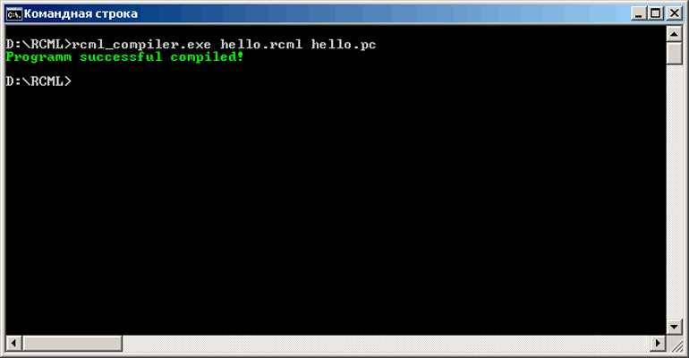
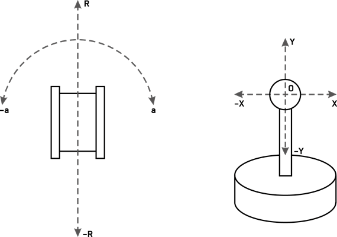
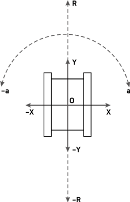

[TOC]

# 1 Установка и настройка компилятора и интерпретатора
### 1.1 Быстрый старт

[Видео-руководство по быстрому старту RCML для Windows](https://youtu.be/gSu8K0n8g3Y)

[Видео-руководство по быстрому старту RCML для Linux](https://youtu.be/AdjV8Ruke_Y)

Перейдите на страницу проекта по ссылке:

[https://rcml.tech/downloads](https://rcml.tech/downloads)

Из папки нужной Вам ОС скачайте архив с файлами компилятора *rcml_build_X.zip* и архив с файлами модулей *rcml_modules_build_X.zip*, где X – версия компилятора. Для этих двух архивов версии должны совпадать.

Распакуйте оба скачанных архива в одну папку.

Перейдите в папку с распакованными файлами и создайте в ней файл *config.ini* со следующим содержимым:
```ini
[robot_modules]
module = test
[function_modules]
[control_modules]
[repository]
[lib_search_paths]
```
В текущей папке создайте ещё один файл с именем *hello.rcml* и со следующим содержимым:
```cpp
function main() {
	robot_test->print("Hello world!\n", 0);
}
```
Это будет первая Ваша программа на языке *RCML*, состоящая из одного оператора – вызова функции вывода в консоль строки *"Hello world!\n"* у тестового виртуального робота *robot_test* с задержкой в 0 сек.

Для компиляции программы запустите редактор командной строки в текущей папке и выполните следующую команду:
```bash
rcml_compiler.exe hello.rcml hello.rcml.pc
```
В текущей папке появится файл скомпилированной программы *hello.pc*.



Рисунок 1 Результат компилирования программы

Чтобы выполнить скомпилированную программу, выполните команду:
```bash
rcml_intepreter.exe hello.rcml
```
Обратите внимание, что тут не указывается расширение *pc* у файла скомпилированной программы. Пример успешного выполнения программы показан на рисунке 2.


Рисунок 2 Результат успешного выполнения программы

### 1.2 Описание процесса подготовки программы на RCML

Написать программу на языке *RCML* можно в любом текстовом редакторе, сохранив её в обычный текстовый файл с расширением *rcml*.

Расширение *rcml* носит рекомендательный характер, на деле файл может иметь любое имя, поддерживаемое файловой системой вашей ОС.

В последующем данный файл компилируется компилятором языка *RCML*, в процессе компиляции выполняется ряд процедур по подготовке программы к исполнению, а именно:

- проверка правильности синтаксиса программы;
- проверка корректности вызовов функций, роботов и передачи параметров;
- преобразование текста программы в байт-код;
- выполнение различных модификаций с байт-кодом для ускорения его выполнения и оптимизации использования памяти.

При успешной компиляции программы компилятором языка *RCML* создается файл с байт-кодом программы, для которого рекомендуется двойное расширение *rcml.pc (PC – pseudo code)*. Под файлом с байт-кодом понимается уже бинарное содержимое, по своей структуре близкое к машинным кодам процессора, исполняемое собственной виртуальной машиной в виду некоторых особенностей языка *RCML*.

Непосредственное выполнение программы производится интерпретатором языка *RCML*, как следует из названия, интерпретирующим инструкции байт-кода посредством внутренней виртуальной машины в реальные команды процессора.

### 1.3 Установка и настройка компилятора и интерпретатора RCML

Компилятор и интерпретатор можно скачать со страницы проекта по ссылке:

[https://rcml.tech/downloads](https://rcml.tech/downloads)

Компилятор и интерпретатор представляют собой два исполняемых файла, которые необходимо поместить в одну папку. Дополнительно в данной папке требуется создать текстовый файл *config.ini*, это конфигурационный файл среды *RCML*. Конфигурация едина для компилятора и интерпретатора.

В данном файле указывается перечень подключаемых модулей с разбивкой по секциям (типам модулей):

- *[robot_modules]* – секция подключения модулей роботов;
- *[function_modules]* – секция подключения функциональных модулей;
- *[control_modules]* – секция подключения модулей управления;
- *[choice_modules]* – секция подключения модулей выбора робота.

Имя подключаемого модуля указывается в свойстве *module* в секции такого же типа, что и модуль. Если подключаемых модулей одного типа несколько, то на каждый из них отводится отдельная строка. Загрузка модулей определенного типа происходит в том порядке, в котором они были указаны в рамках своей секции.

Пример задания подключаемых модулей в *config.ini*:
```ini
[robot_modules]
module = test
module = fanuc
module = kuka
module = abb
module = smc
[function_modules]
module = math
[control_modules]
module = test
module = keyboard
module = gamepad
module = myo
[choice_modules]
module = avg
```
Для модулей всех типов в папке с компилятором и интерпретатором должны быть созданы папки по названию секции *(robot_modules, function_modules, control_modules* или *choice_modules)*. Для каждого модуля в соответствующей его типу папке должна быть создана директория с таким же именем, как и имя модуля, далее данная директория будет называться директорией модуля. Сам модуль представлен файлом динамически подключаемой библиотеки, который должен именоваться так же, как и модуль, но с добавлением суффикса *module* через нижнее подчеркивание. Файл модуля должен находиться в папке модуля. В папке модуля могут находиться прочие файлы, необходимые для работы модуля, например, файлы конфигурации.

Дополнительно в файле *config.ini* могут быть следующие секции:

- *[Repository]* - содержит только свойство *URI*, в котором указывается адрес Репозитория для получения *RCML* модулей (по умолчанию *https://repository.rcml.info/api* ).

- *[Repository/Deployer]* - содержит данные для идентификации в Репозитории, заполнение этой секции необходимо только если вы пользуетесь промышленной версией *RCML* или являетесь разработчиком *RCML* модулей, подробнее в разделе ["Получение лицензии RCML"](#17rcml). Содержит следующие свойства:
	- *UserID* - логин пользователя в Репозитории;
	- *Path* - путь до файла приватного ключа (*\*.key*), являющегося парой к публичному ключу загруженному в репозиторий.

- *[statisctic]* – данная секция может иметь только одно свойство - *db_path* – путь к файлу базы данных куда будет записываться статистика выполнения роботами своих функций. Если файла базы не существует, он будет создан. Если база уже существует, то она будет дополнена. Если это свойство будет отсутствовать или будет пустым, статистика не будет записываться.

- *[lib_search_paths]* – пути поиска скомпилированных библиотек *RCML*. В данной секции в свойстве *path* может быть указан путь по умолчанию где искать библиотеки для *RCML*. Путей может быть несколько, тогда каждый путь задается через отдельное свойство *path*. Поиск требуемой библиотеки по указанным путям производится в том же порядке, в каком были указаны пути в данной секции.

- *[locale_settings]* – секция настроек текущей локали, может содержать только одно совйство – *locale* – в котором задаются параметры текущей локали для *RCML* в виде строки по правилам, принятым в *Linux* среде. По умолчанию текущая локаль является английской и задается значением *en_US.UTF-8*.

Например, чтобы переключить текущую локаль на русский язык необходимо указать *ru_RU.UTF-8*.

**Важно!** Опция *locale_settings* поддерживается только в ОС *Windows*.

Файлы всех поддерживаемых локалей можно скачать из соответствующей директории на официальной странице загрузок проекта на *SourceForge*: [https://sourceforge.net/projects/rcmlang/files/translations/](https://sourceforge.net/projects/rcmlang/files/translations/)

О том, как добавить свою собственную локаль в проект *RCML* можно прочитать на странице репозитория локалей для *RCML*: [https://github.com/rcml-tech/RCML_translations](https://github.com/rcml-tech/RCML_translations)

### 1.4 Подробнее о модулях роботов

Модули роботов занимают одно из ключевых положений в языке *RCML*, поскольку именно через них осуществляется связь и передача команд физическому роботу, см. рисунок 3.


Рисунок 3 Роль модулей роботов в связи с физическими роботами

Модуль робота отвечает за передачу команд от интерпретатора языка *RCML* одному или нескольким роботам одного класса (или типа), которые объединены под этим модулем. Рекомендуется для каждого класса или типа робота использовать отдельный модуль. Интерпретатор *RCML* через задекларированный *API* устанавливает связь с модулем робота, который в свою очередь устанавливает связь с каждым закрепленным за ним роботом. Таким образом, через модуль робота скрывается реализация связи и управления роботом от интерпретатора, что позволяет подключать к нему самых разных роботов. О том, как написать свой модуль робота и подключить его к интерпретатору, читайте документацию для разработчиков.

Дополнительно роботы модуля в зависимости от заложенного в них функционала могут предоставлять возможность ручного управления роботом посредством управляющего устройства, представленного в среде *RCML* соответствующим модулем.

### 1.5 Подробнее о модулях функций

Через модули функций возможно добавление в язык *RCML* новых функций, которые не целесообразно или невозможно реализовывать на данном языке, например, какие-либо сложные вычисления. Таким образом, через отдельный *API* модули функции позволяют реализовать связь *RCML* с прочим ПО.

### 1.6 Подробнее о модулях управления

Модули управления служат для связи различных управляющих устройств со средой *RCML* с целью использования данных устройств в ручном управлении роботами, чьи модули предоставляют такую возможность. Данный тип модулей подобен модулям роботов в том плане, что через заданный API происходит разрыв зависимостей между управляющим устройством и роботом. Таким образом реализуется возможность управления одним и тем же роботом разными устройствами, а также возможность применения одного и того же устройства управления для разных роботов. Разумеется, при этом достигается тот же эффект сокрытия реализации связи устройства управления от среды *RCML* и возможность подключения самых разных устройств управления.

### 1.7 Подробнее о модулях выбора робота

Модули данного типа используются для принятия решения о выборе очередного робота при необходимости выполнения той или иной функции. Как вариант выбор может быть основан на накопленных ранее статистических данных, об этой функции, роботе или программе. Через модули выбора возможно произвести выбор робота по различным алгоритмам, заложенным в них (модулях). Обычно отдельный модуль представляет отдельный алгоритм выбора робота.

Без данных модулей выбор роботов происходит по решению модулей роботов. Подробнее о работе механизма выбора робота в разделе ["Использование модуля выбора робота"](#37).

### 1.8 Компиляция и запуск программы RCML

Как отмечалось ранее, написанная на языке *RCML* программа сначала должна быть откомпилирована в байт-код, и лишь только потом она может быть запущена на выполнение интерпретатором *RCML*.

Для компиляции программы нужно запустить компилятор *RCML*, наименование его исполняемого файла по умолчанию (без расширения, так как в зависимости от ОС оно может быть различным) - *rcml_compiler*. При запуске компилятора ему нужно передать 2 параметра:
```bash
rcml_compiler <rcml_text_file> <rcml_pc_file>
```
В качестве первого параметра *rcml_text_file* указывается путь до файла с *RCML* программой, а в качестве второго параметра *rcml_pc_file* - путь до файла, в который нужно записать полученный байт-код данной программы.

Если компиляция будет выполнена успешно, то файл с байт-кодом будет создан или перезаписан, если он уже имеется. И теперь его можно запустить на выполнение через интерпретатор *RCML*, имя исполняемого файла которого по умолчанию - *rcml_interpreter*. Компилятор при запуске ожидает всего один параметр – файл с байт-кодом. Синтаксис команды запуска интерпретатора:
```bash
rcml_interpreter <rcml_pc_file>
```

### 1.9 Параметры командной строки RCML

Командная строка *RCML* компилятора имеет следующий шаблон:
```bash
rcml_compiler [--version] [--logfile log_file_path] [--without-optimization] <rcml_text_file> <rcml_pc_file>
```
- *--version* - вывод текущей версии *RCML* компилятора, списка версий, поддерживаемого *API* модулей, а также даты сборки. При указании этого флага компилятор выводит информацию и сразу же завершает работу;
- *--logfile log_file_path* - переключение вывода *RCML* компилятора в файл по пути *log_file_path*;
- *--without-optimization* - отключает выполняемые компилятором оптимизации байт кода, что значительно позволяет повысить скорость работы компилятора при выгрузке в *RCML* программу большого числа точек из CAM среды (постпроцессинг);
- *rcml_text_file* - путь до файла с *RCML* программой в текстовом представлении;
- *rcml_pc_file* - путь до файла, в который записать скомпилированную программу.

Командная строка *RCML* интерпретатора имеет следующий шаблон:
```bash
rcml_interpreter [--version] [--hardware-info] [--logfile log_file_path] [--debug] <rcml_pc_file> [rcml_params]
```
- *--version* - вывод текущей версии *RCML* интерпретатора, списка версий, поддерживаемого *API* модулей, а также даты сборки. При указании этого флага интерпретатор выводит информацию и сразу же завершает работу;
- *--hardware-info* - сбор информации об аппаратной конфигурации, необходимо для получения лицензии, подробнее в разделе ["Сбор аппаратной информации"](#173).
- *--logfile log_file_path* - переключение вывода *RCML* интерпретатора в файл по пути *log_file_path*;
- *--debug* - подключение к запущенному RCML-дебаггеру, используется для отладки и пошагового выполнения *RCML* программ;
- *rcml_pc_file* - путь до файла скомпилированной *RCML* программы;
- *rcml_params* - параметры запускаемой *RCML* программы. Подробнее о параметрах *RCML* интерпретатора в разделе ["Передача параметров в программу на RCML"](#91rcml).
***

# 2 Основы построения программ на RCML
### 2.1 Алфавит языка и специфика использования символов

Алфавит языка *RCML* составляют:

1. Символы, используемые для составления идентификаторов:
   - латинские строчные или прописные буквы;
   - арабские цифры от 0 до 9;
   - символ подчеркивания «_»;
2. Символы-разделители:
   -  символ пробела;
   - символ табуляции;
   - символы переноса строки;
3. Специальные символы – символы, выполняющие определенные функции при построении различных конструкций языка: + - * / = { } ( ) < > , ; : ~ # @ ! "
4. Составные символы – группа символов, которые воспринимаются компилятором как единое целое: :: -> == >= <= !=
5. «Неиспользуемые» символы – символы, которые не входят во множество выше обозначенных, но, тем не менее, могут быть использованы в комментариях или для задания значений констант и строк;
6. Зарезервированные слова, перечисленные в разделе ["Перечень зарезервированных ключевых слов"](#13).

### 2.2 Правила составления идентификаторов

Идентификатор – имя, свободно избираемое программистом для элементов программы (функций, переменных и т.д.):

- идентификатор должен начинаться с буквы или символа подчеркивания;
- начиная со второй позиции в идентификаторе можно применять наряду с буквами цифры;
- при указании идентификаторов учитывается регистр вводимых символов;
- пробел является разделителем и не может стоять внутри идентификатора;
- зарезервированные слова в качестве идентификаторов не допускаются.

### 2.3 Общая структура программ в RCML

Программа на языке *RCML* состоит из двух ключевых разделов: раздел **включений** и раздел **функций**.

Пример программы на языке *RCML*:
```cpp
// Раздел включений
include “function.rcml”
include “C:/robot/robot.rcml”

// Раздел функций
function sum(a, b) {
	c = a + b;
	return c;
}
function main() {
	s = sum(1, 2);
	echo(“sum = ”,s,”\n”);
}
```
Раздел включений всегда идет перед разделом функций. В разделе включений могут быть указаны другие файлы программ на *RCML*, текст которых нужно включить в данную программу. Это могут быть наборы каких-либо функций, дополнительные библиотеки и т.д. Однако раздел включений может быть и пустым.

Раздел функций начинается после первого упоминания ключевого слова *function*. В разделе функций указывается основной код программы, который состоит из функций.

По аналогии с языками программирования C и C++, выполнение начинается с функции с именем *main*, которая обязательно должна присутствовать. Данное утверждение относится к исполняемым программам на *RCML*, не являющимся библиотеками. Подробнее об библиотеках в разделе ["Создание файла библиотеки RCML"](#11rcml).

### 2.4 Включение дополнительных файлов RCML в программу

Дополнительные файлы программ на *RCML* включаются следующим образом: каждый включаемый файл записывается с новой отдельной строки, в начале следует ключевое слово include, затем через разделяющий символ (например, пробел) путь до включаемого файла в двойных кавычках.

Синтаксис:
```cpp
include “путь_к_файлу”
```
Примеры:
```cpp
include “function.rcml”
include “C:/robot/robot.rcml”
include “../libs/robot.rcml”
```
Путь до включаемого файла может быть абсолютным или относительным. В случае если путь относительный, то компилятор сначала вычисляет абсолютный путь до включаемого файла относительно абсолютного пути файла, в котором встречена данная конструкция включения. Если файл по полученному пути не найден, то компилятор вычисляет абсолютный путь относительно каждого варианта пути из параметра path из раздела *lib_search_paths* в конфигурационном файле *config.ini* в том порядке, в котором эти пути были указаны в файле конфигурации.

Данный параметр path из раздела *lib_search_paths* конфигурационного файла называется «путь поиска по умолчанию». Синтаксис задания путей поиска по умолчанию:
```ini
[lib_search_paths]
path = путь_1
path = путь_2
```
Порядок включения дополнительных файлов с кодом такой же, в каком они были указаны в исходном rcml файле.

**Важно! В случае обнаружения во включаемом файле непустого раздела включений, файлы из этого раздела будут включены перед текущим включаемым файлом.** Можно провести аналогию к тому, что вместо конструкции *include* будет помещен текст включаемого файла целиком.

Для каждого включаемого файла вычисляется абсолютный путь, вновь включаемые файлы с таким же абсолютным путем не будут включены в программу.

Следует понимать механизм включения дополнительных файлов в программу. Проверка правильности синтаксиса каждого включаемого файла происходит перед включением, а компиляция программы с учетом всех вычислений и оптимизаций происходит только после составления полного текста программы с учетом всех включаемых файлов.

### 2.5 Включение файлов библиотек RCML в программу

Дополнительные библиотеки, написанные на *RCML*, включаются следующим образом: каждая включаемая библиотека записывается с новой отдельной строки, в начале которой следует ключевое слово *include_lib*, затем разделяющий символ (например, пробел), затем идентификатор - имя библиотеки (через которое будет происходить обращение к библиотеке в коде программы), затем разделяющий символ и путь до файла с байт-кодом библиотеки (*pc*-файл) в двойных кавычках.

Синтаксис:
```cpp
include_lib имя_библиотеки “путь_до_файла_библиотеки”
```
Пример программы, использующей включение библиотеки *math*:
```cpp
include_lib math "../export_library/etalon.rcml.pc"
function main() {
	s = math.sum(1,2);
	system.echo("\n1 + 2 =",s,"\n");
}
```
Процесс создания библиотеки описан в разделе ["Создание файла библиотеки RCML"](#11rcml).

Процесс поиска файла библиотеки компилятором аналогичен поиску включаемого файла. Однако включения кода библиотеки в исполняемый код программы не происходит. В исполняемой программе создается ссылка на файл библиотеки, и для запуска такой программы также потребуется файл скомпилированной библиотеки, как и при компиляции.

Допускается включение одного и того же файла библиотеки под разными именами-идентификаторами. 

Стоит отметить, что библиотеки могут ссылаться на другие библиотеки, т.е. при компиляции библиотеки допускается включение в неё других библиотек.

### 2.6 Функции

Как было отмечено ранее, в исполняемой программе, не являющейся библиотекой, всегда должна присутствовать функция с именем *main* (далее основная функция), именно с неё начинается выполнение. При этом неважно, где будет находиться данная функция: в исходном файле или в одном из включаемых. Важно, чтобы эта функция была одна и только одна.

Разумеется, программист вправе создавать новые функции, помимо функции *main*, с именами, соответствующими правилам задания идентификаторов, и обращаться к ним как в основной функции, так и в прочих.

Задание новой функции начинается с ключевого слова *function*, далее через разделитель следует наименование функции, затем в круглых скобках список параметров, который может быть пустым. После списка параметров в фигурных скобках следует код функции – список её операторов.

Синтаксис задания функции:
```cpp
function имя_функции(список_параметров) {
	список_операторов
}
```
Пример функции:
```cpp
function sum(a, b) {
	c = a + b;
	return c;
}
```
Функция в языке *RCML* может как возвращать значение, так и не возвращать. Возврат значения, как и выход из функции происходит через оператор *return*. 

В конце функции данный оператор указывать необязательно, если значение не возвращается. Если функция не возвращает значения, то по умолчанию возвращаемое значение считается нулем - 0.0.

Параметры функции всегда передаются по значению, поэтому их можно использовать как обычные переменные в теле функции, не боясь перезаписи данных в родительской функции, из которой была вызвана текущая дочерняя функция.

Порядок расположения функций относительно друг друга не важен и никак не влияет на область их видимости. Каждая функция может быть вызвана из любой другой функции, за исключением основной функции. Поскольку с неё начинается выполнение, её вызов в коде функций запрещён. Стоит отметить, что внутри функции нельзя объявить функцию.

Параметры в основной функции *main* имеют особое значение, подробнее в разделе ["Передача параметров в программу на RCML"](#91rcml).

### 2.7 Комментарии

В *RCML* доступны однострочные и многострочные комментарии. Однострочный комментарий начинается с двойного знака косой черты // и следует до конца строки.

Пример:
```cpp
//Это комментарий
```
Многострочный комментарий начинается со комбинации символов /\* и следует до следующей комбинации символов \*/

Пример:
```cpp
/* Это
многострочный
комментарий */
```

### 2.8 Типы данных

В *RCML* присутствуют явные типы данных и неявные. К первым относятся те типы данных, переменные которых могут быть созданы и использованы в различных операциях. Ко вторым же, наоборот, переменные которых не могут быть созданы, но эти типы данных могут неявно получиться при некоторых операциях, или их можно использовать как параметры для специфичных функций. От данного разделения обособлен тип данных для связи с физическим роботом.

Стоит отметить, что на данном этапе развития *RCML* иные типы данных, в том числе и массивы, пока не предусматриваются.

#### 2.8.1 Явные типы данных

Явный тип данных в *RCML* всего один – это вещественные числа. Все создаваемые переменные, используемые в операциях, параметры и возвращаемые значения пользовательских функций, а также всех функций модулей и роботов являются вещественными числами.

#### 2.8.2 Неявные типы данных

К неявным типам данных на языке *RCML* относятся логический и строковый типы.

В логический тип данных принудительно преобразуются данные, используемые при вычислении логических выражений.

Строковый тип данных используется только для задания строковых констант, которые могут быть параметрами для функций системного уровня (системные функции *RCML*, функции модулей роботов и функциональных модулей). Строковой константой является последовательность любых символов, заключенная в двойные кавычки, при этом в строковой константе могут быть указаны следующие управляющие наборы символов, считающиеся за один символ:

- \n – переход на новую строку;
- \” – вставка символа двойной кавычки;
- \ \ - вставка символа обратной косой черты (обратный слэш).

### 2.9	Переменные

Переменная в языке *RCML* инициализируется в момент первого присвоения ей значения и остается видимой от точки инициализации до конца тела функции, в которой используется. Для присвоения значения переменной используется одинарный символ «=». Переменной могут быть присвоены константные значения, результаты выражений и вызовов функций. Переменная может быть передана как аргумент функции. Переменные, являющиеся параметрами функции, инициализируются при переходе выполнения в данную функцию.

Пример использования переменных в функции:
```cpp
function sum_by_abs(a, b) {
	c = a + b;
	if (c < 0) {
		с = -с;
	}
	return c;
}
```
В *RCML* нет глобальных переменных.

Программист может не заботиться о расходе памяти и не удалять использованные переменные, когда в них отпадает необходимость. Об этом заботится компилятор при оптимизации получаемого байт-кода, просчитывая пути жизни каждой переменной. Однако, это не относится к особым переменным, связанным с физическими роботами.

### 2.10 Выражения и операции

Выражения в *RCML* могут состоять из числовых констант, переменных и возвращаемых результатов функций, которые могут быть использованы в качестве операндов математических и логических операций в составе выражения. Операции, в свою очередь, могут быть бинарными или унарными. Приоритет операций в выражениях задается круглыми скобками, так же, как это принято в математике. Результат выражения может быть присвоен в переменную или передан как параметр функции, что возможно для тех параметров функций, которые работают с явными типами данных. Использование особых переменных для связи с роботом в контексте выражений запрещено на уровне синтаксических правил.

Примеры выражений:
```cpp
a = 1 + 1;
a – 5;
c = a * b;
d = sum(a, с) * 10 * (a / c);
e = -d + 15;
f = d >= 10;
!f;
```

#### 2.10.1 Математические операции

В *RCML* доступны следующие бинарные математические операции:

- «+» - операция сложения;
- «-» - операция вычитания;
- «*» - операция умножения;
- «/» - операция деления без остатка;
- «%» - взятие остатка от операции деления.

И одна унарная операция:

- «-» - смена знака.

#### 2.10.2 Логические операции

Из логических операций в *RCML* доступны следующие бинарные операции:

- «==» -проверка равенства;
- «!=» -проверка неравенства;
- «>=» - проверка больше или равно;
- «<=» - проверка меньше или равно;
- «>» - проверка больше;
- «<» - проверка меньше;
- «&&» - конъюнкция, логическое «И»;
- «||» - дизъюнкция, логическое «ИЛИ».

И одна унарная операция:

- «!» - логическое отрицание.

### 2.11 Преобразование типов данных

При использовании различных типов операций в одном выражении происходит неявное преобразование типа данных результата выражения к ожидаемому типу операнда следующей операции. Результат будет вещественным, если он сохраняется в переменную или передается как параметр функции, или строго логическим, если используется в условном операторе.

При преобразовании вещественного типа в логический выполняется следующее правило: 

*если элемент не равен нулю, то результат - истина, иначе - ложь.* 

При обратном преобразовании выполняется правило:

*если истина, то результат будет 1.0, если ложь, то результат 0.0.*

### 2.12 Управляющие конструкции

Язык *RCML* предусматривает стандартный набор конструкций, влияющих на ход выполнения программы. Их можно разделить на условные, циклические и безусловные.

#### 2.12.1 Условные управляющие конструкции

В *RCML* представлен всего один оператор условного перехода - *if*. Синтаксис его использования следующий:
```cpp
if (выражение) {
	//набор операторов, если результат выражения истина
} else {
	//набор операторов, если результат выражения ложь
}
```
Результат выражения, заключенного в круглых скобках, приводится к логическому типу, и если результат – истина, то выполняется первый блок операторов в фигурных скобках, иначе — второй блок операторов после ключевого слова *else*. Второй блок операторов вместе с ключевым словом *else* может опускаться при задании условного оператора.

#### 2.12.2 Циклические управляющие конструкции

Циклический оператор в *RCML* так же единствен, это оператор *loop*. Это более упрощенный оператор цикла по сравнению с аналогичными операторами в традиционных языках программирования. Он является безусловным, и его блок операторов будет выполняться бесконечно, если в нем не будет соответствующей конструкции выхода с предварительным условием или без него. Синтаксис оператора *loop* следующий:
```cpp
loop {
	// блок операторов цикла
}
```

#### 2.12.3 Прочие управляющие конструкции

К прочим управляющим конструкциям в языке *RCML* относятся операторы безусловного перехода, при достижении которых выполнение программы переходит на тот или иной участок.

Оператор перехода на начало цикла – *continue*. При его достижении происходит переход на начало текущего цикла. Используется без параметров.

Оператор выхода из цикла – *break*. При его достижении происходит прерывание текущего цикла. Используется без параметров.

Оператор выхода из функции – *return*. Может указываться как с выражением, так и без него, в первом случае результатом выполнения функции будет результат, возвращаемый выражением, во втором случае функция будет возвращать значение по умолчанию – 0.0.

Синтаксис использования оператора *return* с возвратом выражения:
```cpp
return выражение;
```
Без возврата выражения:
```cpp
return;
```
Примеры использования оператора *return*:
```cpp
return 2+2; //выход из функции в возвратом значения
return; //выход из функции без возврата значения
```
В случае если оператор *return* будет указан в функции *main*, то его выполнение приведет к завершению работы *RCML* программы, а значение, переданное через данный оператор, будет передано в ОС как код завершения программы. Однако при этом передаваемое значение будет округлено до целых посредством отброса дробной части.

Оператор выхода из программы – *exit*. При достижении этого оператора происходит завершение выполнения программы независимо от того, в какой функции он указан. Данный оператор также, как и оператор *return* может вызываться как с выражением, так и без него. В первом случае в ОС возвращается результат выражения как код завершения программы, во втором случае код завершения программы считается равным 0.

Синтаксис использования оператора exit с возвратом выражения:
```cpp
exit выражение;
```
Без возврата выражения:
```cpp
exit;
```

### 2.13 Исключения

В *RCML* возможна обработка исключительных ситуаций, возникающих в определенном блоке кода, как и в некоторых других языках программирования. Общий вид конструкции обработки исключения начинается с оператора try, затем за ним следует блок операторов, в котором может возникнуть исключение в процессе исполнения операторов данного блока, далее может следовать оператор catch и блок операторов, который необходимо выполнить в случае появления исключения. Общий вид конструкции обработки исключений следующий:
```cpp
try {
	//блок операторов, в котором может возникнуть исключение
} catch {
	//блок операторов для обработки ситуации с исключением
}
```
При появлении исключения в блоке оператора *try* выполнение программы переходит на блок оператора *catch*. Следует отметить, что оператор *catch* и его блок может быть опущен, и тогда выполнение программы перейдет на оператор, следующий за блоком оператора *try*. Конструкция обработки исключений может быть вложена одна в другую, и, в случае возникновения исключения, оно будет обрабатываться текущей конструкцией.

Исключения могут возникать при выполнении различных функций, предоставляемых внешними или системными модулями *RCML*, такими как функциональные или модули роботов, но выброс исключения можно вызвать и вручную, используя оператор *throw*. При выполнении этого оператора сразу же будет брошено исключение.

Работа механизма исключений на примере простой программы деления чисел:
```cpp
function main() {
	try {
		echo(“this simple division program\n”);
		echo(“c = a / b \n”);
		try {
			echo(“input a\n”);
			a = input();
			echo(“input b\n”);
			b = input();
			if (!b) { // если b ноль, то делить нельзя
				throw; //бросаем исключение
			}
			c = a / b;
			echo(“c = ”, c, “\n”);
		} catch {
			echo(“b is zero!”); //обработка исключения будет в этом блоке
		}
	} catch {
		//этот блок никогда не будет выполнен
	}
}
```
Однако в языке *RCML*, ориентированном на робототехнику, в отличие от других языков программирования, оператор *try* может принимать параметры, указывающие, как именно ему работать. Первый параметр, который принимает оператор *try* -  это строковая константа с указанием режима работы, в зависимости от указанного режима может указываться второй параметр вещественного типа данных.

Всего у оператора try три режима работы:

- *“error_default”* - режим работы по умолчанию, как обычный оператор *try*. В этом случае второй параметр оператора *try* не указывается. Если параметры оператора *try* опускаются как в вышеприведенном примере, то оператор *try* работает именно в этом режиме.
- *“error_time_limit”* – режим работы с отсчетом лимита времени, за который должен быть выполнен блок кода оператора *try*. В данном случае указывается второй параметр, который задает количество миллисекунд, являющийся лимитом на выполнение блока кода оператора *try*. В случае если данный блок не будет выполнен за указанное время, будет брошено исключение. В случае если исключение будет брошено раньше, отсчет времени будет прекращен, а само исключение будет обработано в обычном режиме.
- *“error_try_count”* – режим работы с отсчетом количества попыток, данных для выполнения блока оператора *try*. В данном режиме второй параметр принимает количество допустимых попыток исполнения данного блока. При каждом брошенном исключении в блоке оператора *try* счетчик количества попыток будет уменьшаться на 1, и если он достигнет нуля, то будет произведена обычная обработка исключения.

Несмотря на то, что оператор *try* может принимать параметры, он не является функцией и не возвращает значение.

Пример использования указанных режимов для обработки успешности выполнения роботом своей функции с выдачей ему трёх попыток с лимитом времени по 2 секунды на каждую:
```cpp
try(“error_try_count”, 3) {
	try(“error_time_limit”, 2000) {
		robot->do_something();
	} catch { //если время вышло
		throw; //то бросаем исключение, чтобы исчерпать попытку
	}
} catch {
	//этот блок выполнится, когда все попытки будут исчерпаны, 
	//а результат так и не будет получен
}
```
Через оператор *throw* с исключением можно передать какое-либо значение (значение исключения). В данном случае синтаксис оператора *throw* будет следующий:
```cpp
throw выражение;
```
Для обработки значения выброшенного исключения оператор *try* будет иметь немного иной синтаксис, в параметрах оператора *catch* должен быть указан идентификатор - имя переменной, в которую будет записано исключение:
```cpp
try {
	//блок операторов, в котором может возникнуть исключение
} catch (имя_переменной) {
	//блок операторов для обработки ситуации с исключением
}
```
Если на момент появления исключения указанная переменная не существует, то она будет создана, в противном случае перезаписана.
```cpp
try {
	throw 3;
} catch (E) {
	system.echo(“E = ”, E, “\n”); //выведет E = 3
}
```
Переменная, в которую записывается значение исключения, будет доступна не только в блоке *catch*, но и за его пределами до конца функции.

Пример с созданием переменной:
```cpp
system.echo(“E = ”, E, “\n”); //ошибка E ещё не существует
try {
	throw 3;
} catch (E) {
	system.echo(“E = ”, E, “\n”); //выведет E = 3
}
system.echo(“E = ”, E, “\n”); //выведет E = 3, т.к. E была создана в блоке catch
```
Пример с перезаписью значения:
```cpp
E = 5;
system.echo(“E = ”, E, “\n”); // выведет E = 5
try {
	throw 3;
} catch (E) {
	system.echo(“E = ”, E, “\n”); //выведет E = 3
}
system.echo(“E = ”, E, “\n”); //выведет E = 3
```
Подобным образом возможна обработка переданного значения исключения не только посредством оператора *throw*, но также и обработка значений исключений передаваемых из функций модулей роботов и функциональных модулей, а также библиотек.

Пример:
```cpp
try {
	robot_test->throw_value(10);
} catch (E) {
	system.echo(“E = ”, E, “\n”); //выведет E = 10
}
```
Если выброшенное исключение не было перехвачено в *RCML* программе, то произойдет завершение работы программы с кодом 1, т.е. с ошибкой, что может служить средством коммуникации ОС и *RCML* программы (подробнее в разделе ["Коммуникация с ОС"](#9)). При этом значение исключения будет утрачено. 

### 2.14 Вызов функций

Функции на языке *RCML* могут быть внутренними и внешними.

Под внутренними функциями понимаются функции, описанные на языке *RCML* в текущем файле исходного кода программы или во включаемых файлах с исходным кодом на *RCML*. Код таких функций находится внутри текущей программы и будет скомпилирован в исполняемый файл текущей программы.

Внешние функции - это функции уже скомпилированных библиотек *RCML*, подключаемых к текущей программе, либо функции функциональных модулей, т.е. код таких функций находится вне текущей *RCML* программы.

Синтаксически вызов внутренней функции в языке *RCML* выглядит так же, как и в других языках программирования. Сначала следует идентификатор – имя функции, затем в круглых скобках список передаваемых в неё аргументов:
```cpp
идентификатор(аргумент1, аргумент2, аргумент3)
```
Результат вызова любой функции может быть присвоен переменной или использован в выражении. Стоит отметить, что при вызове функции должны быть переданы через аргументы все параметры, указанные в её описании, за исключением некоторых системных функций языка *RCML*.

Вызов внешней функции имеет иной синтаксис:
```cpp
имя_источника.имя_функции(аргумент1, аргумент2, аргумент3)
```
В качестве имени источника используется идентификатор (имя) подключаемой библиотеки из раздела включений или имя функционального модуля, указанного в конфигурационном файле. Описание имен и аргументов внешних функций обычно можно найти в документации к соответствующему источнику - библиотеке или функциональному модулю.

Следует отметить, что при поиске внешней функции искомый источник ищется, в первую очередь, среди подключенных библиотек, затем среди подключенных функциональных модулей. Если источник найден, в нем по наименованию ищется требуемая функция, если функция найдена, то сверяется количество параметров функции, задекларированных в источнике, с количеством аргументов, передаваемых пользователем. В случае если количество аргументов и параметров совпадает, считается, что искомая функция найдена, в любом другом случае выдается ошибка.

*RCML* имеет системный модуль *system*, всегда доступный в программе и предоставляющий системные функции языка *RCML*. Если в качестве источника внешних функций указывается данное имя, то поиск функции происходит сразу в этом модуле, игнорируя библиотеки с аналогичным именем.

### 2.15 Системные функции языка RCML

Системные функции языка *RCML* доступны в среде *RCML* через системный модуль *system*. Доступ к данным функциям происходит так же, как ко внешним функциям модуля с указанием имени *system*.

Системный модуль имеет следующие функции:

- *system.input* – функция считывания числа из строки, полученной через стандартный ввод. Считываемая строка должна состоять из цифр и опционально из знака + или -. Затем она преобразовывается в число, которое возвращается как результат вызова функции. Данная функция параметров не имеет.
- *system.echo* – функция вывода данных, переданных в качестве аргументов, в стандартный вывод. Может принимать любое число параметров, среди которых допускаются строковые константы и выражения.
- *system.set* – функция изменения системных параметров среды *RCML*. Принимает два аргумента: название системного параметра и его новое значение. Название системного параметра задается строковой константой, а новое значение этого параметра зависит от указываемого имени системного параметра. Доступные системные параметры следующие:
	- *"behavior"* – режим выполнения функций по умолчанию. В качестве второго параметра передается флаг режима, знак ~ или #. Подробнее о режимах выполнения читайте в разделе ["Пакетная передача команд роботам"](#8).
	- *"priority"* - приоритет задействования роботов для текущей функции. Второй параметр значение приоритета - вещественное число, чем больше это значение тем больший приоритет получает функция при задействовании роботов.
- *system.sleep* – временная пауза в процессе выполнения программы. Принимает один числовой параметр – время паузы в миллисекундах.
- *system.hand_control* – включение режима ручного управления для робота. Функция переводит указанного робота в режим ручного управления посредством указанного модуля управления. Выполнение основной программы на период ручного управления приостанавливается. Данная функция принимает переменное число параметров:
	- первый параметр – специальная переменная, связанная с нужным физическим роботом. Обязательный параметр;
	- второй параметр – строковая константа – наименование модуля управления. Обязательный параметр;
	- третий параметр – строковая константа – ось робота;
	- четвертый параметр – наименование оси управляющего устройства в виде строковой константы или выражения, которые будут задавать значения для оси робота, указанной в предыдущем параметре.
	- пятый и шестой, седьмой и восьмой и т.д. параметры задаются всегда попарно: ось робота и источник значений для неё.
- *system.send_package* – команда для отправки накопленного пакета команд для роботов. В качестве единственного параметра передается флаг режима выполнения команд из пакета, ~ или #. Подробнее о данной функции в разделе [«Указание режимов выполнения функций»](#6).
- *system.mutex_lock* – производит попытку блокировки мьютекса с именем указанным в качестве строкового параметра. Если мьютекс свободен блокирует его. Если мьютекс занят, то ожиает его освобождения, а затем блокирует. Подробнее в разделе ["Блокировки"](#10).
- *system.mutex_unlock* – снимает блокировку мьютекса с именем указанным в качестве строкового параметра. Если мьютекс уже свободен, бросает исключение.
- *system.semaphore_create_lock* – создает семафор с именем указанным в качестве первого параметра и количеством блокировок указанных во втором параметре. Если семафор с таким именем уже создан, бросает исключение.
- *system.semaphore_wait* – ожидает переключения семафора, пока счетчик блокировок не будет равным нулю. Имя семафора указывается в качестве единственного строкового параметра.
- *system.semaphore_unlock* – уменьшает счетчик блокировок семаформа на 1, принимает один строковый параметр - имя семафора.

### 2.16 Макросы

Язык *RCML* реализует поддержку макросов. Макросом является связка идентификатора – имени макроса -  с произвольным текстом – содержание макроса. Макросы объявляются в разделе включений через ключевое слово *define*, после которого следует разделитель, затем следует идентификатор, являющийся именем макроса, снова разделитель и текст макроса.

Синтаксис задания макроса:
```cpp
define имя_макроса содержимое_макроса
```
Все вхождения имени макроса в тексте раздела функций будут заменены на его содержание. После определения макроса его невозможно переопределить другим макросом.

Содержимым макроса считается любой текст между символом-разделителем, следующим после имени макроса, и концом строки. Макрос может иметь многострочное содержимое, для его задания нужно поставить символ «\», т.е. экранировать конец строки, так же, как это делается в многострочных макросах на С++. Тогда содержимым макроса будет считаться всё до конца строки, следующей за строкой, оканчивающийся на данный символ. Символы перевода строки в многострочных макросах сохраняются.

Пример использования макросов:
```cpp
define ONE 1
define TWO 2
define TREE ONE + \
TWO
define TEST_MS "test message"

function main(){
	system.echo("1 = ",ONE,"\n");
	system.echo("2 = ",TWO,"\n");
	system.echo("3 = ",TREE,"\n");
	system.echo("Test print > ",TEST_MS,"\n");
}
```
Данный текст после обработки макросов будет преобразован к следующему тексту программы:
```cpp
function main(){
	system.echo("1 = ",1,"\n");
	system.echo("2 = ",2,"\n");
	system.echo("3 = ",1 + 
2 ,"\n");
	system.echo("Test print > ","test message","\n");
}
```
Полученный текст уже будет компилироваться в байт-код. Результат выполнения данной программы будет выглядеть следующим образом:
```cpp
1 = 1.000000
2 = 2.000000
3 = 3.000000
Test print > test message
```

**Важно! Опасно использовать макросы, которые рекурсивно ссылаются друг на друга, в данном случае образуется бесконечная рекурсия, которая приведет к зависанию компилятора. На данном этапе развития языка обнаружение замкнутой рекурсии в макросах не происходит.**

Пример замкнутой рекурсии:
```cpp
define ONE TWO
define TWO ONE
```
***

# 3 Особенности взаимодействия программы с роботом

Как отмечалось выше, язык *RCML* ориентирован на робототехнику и имеет довольно скудную составляющую как язык программирования, так как не предназначается для создания прикладного ПО общего назначения и нацелен на взаимодействие с робототехникой, позволяя достигать в этом отношении новых результатов.

### 3.1 Понятие робота в RCML

Робот в *RCML* представляется как некий исполнительный ресурс, который может быть задействован для выполнения определенной задачи (функции), а затем освобожден для повторного задействования, но, например, в уже другой задаче. Ближайшая аналогия — вычислительное ядро процессора, которое в конкретный момент времени может быть занято только одним процессом. Однако средствами ОС, выделяющей очень малые кванты процессорного времени разным программным процессам или задачам, возможно создание иллюзии, что одно ядро обрабатывает сразу несколько задач. В *RCML* же управлением роботом как ресурсом занимается интерпретатор, но робот задействован не на период времени, а на выполнение конкретной своей функции или нескольких, и, таким образом, время его задействования может быть разным.

Робот является объектом проявленного материального мира, и его действия зачастую не так мгновенны, как в приведенной аналогии с ядром процессора. И на выполнение своей функции ему требуется время, и это время может быть разным для одной и той же функции, поскольку на робота воздействует множество факторов материального объектного мира.

Модуль робота как таковой предоставляет среде *RCML* описание класса робота, закрепленного за ним, предполагается, что локально в объектном мире, где используется *RCML*, может быть, как один, так и несколько роботов одного класса, закрепленных за одним модулем робота. Причем в среде *RCML* в рамках модуля робота присутствует два ключевых типа объектов, в соответствии с рисунком 4:

- модуль робота исполняет функции контроллера роботов вверенного ему класса, то есть выполняет функции выбора свободного робота для задействования и освобождения робота после работы;
- представление робота – отражение конкретного физического робота в виртуальной среде *RCML*, через него транслируются команды физическому роботу.


Рисунок 4 Виртуальное представление классов объектов в среде *RCML*

Следует отметить, что может быть подключено много классов роботов одновременно, то есть много модулей роботов, и каждый из них может предоставлять доступ сразу к нескольким роботам своего класса. Роботы в рамках одного класса должны быть полностью одинаковы в функциональном представлении.

### 3.2 Использование робота в программе

Чтобы задействовать робота в программе, необходимо указать его класс и функцию, которую он должен выполнить. Именование класса робота совпадает с именованием модуля робота в файле *config.ini*, но класс робота в *RCML* программе должен указываться через ключевое слово *robot* и знак подчеркивания. 

Синтаксис задействования робота:
```cpp
robot_класс_робота
```
Например, нужно вызвать робота из модуля *test*, тогда указание его класса будет иметь вид:
```cpp
robot_test
```
Встретив наименование класса робота в тексте программы, система пошлет запрос к соответствующему модулю робота и остановит выполнение программы, пока не будет найден свободный робот требуемого класса.

### 3.3 Вызов функции робота

Получив робота нужного класса, программист может заставить его выполнить требуемое действие, т.е. вызвать выполнение какой-либо функции этого робота. Функции роботов программируются разработчиком робота вместе с модулем робота и описываются в документации к модулю робота.

Вызов функции визуально похож на вызов метода объекта в С-подобных языках программирования. Следует указание класса робота, затем через знак указателя -> указывается обозначается требуемая функция, затем в круглых скобках перечисляется список аргументов этой функции. 

Cинтаксис вызова функции робота:
```cpp
robot_класс_робота->функция_робота(аргументы);
```
Например, из робота класса *test* нужно вызвать функцию *do_something* с одним аргументом 1000:
```cpp
robot_test->do_something(1000);
```

Встретив подобную конструкцию, интерпретатор зарезервирует робота указанного класса, дождется, когда будет задействован реальный физический робот, и затем передаст команду представлению робота об исполнении указанной функции с указанными параметрами. После исполнения функции робот будет автоматически освобожден и переведен в статус свободного.

Следует отметить, что при таком указании вызова функции робота интерпретатор дождется подтверждения выполнения функции от представления робота и только затем продолжит выполнение остальной программы. Подробнее об флагах выполнения функции рассказано в разделе [«Указание режимов выполнения функций»](#6).

В зависимости от того, как и где описано исполнение функций робота, их (функции) можно разделить на 3 типа:

- пользовательские функции – функции, описанные на языке *RCML* в текущем файле исходного кода программы или во включаемых файлах с исходным кодом на *RCML*. Код таких функций находится внутри текущей программы и будет скомпилирован в исполняемый файл текущей программы;
- библиотечные функции – функции уже скомпилированных библиотек *RCML*, подключаемых к текущей программе, т.е. код таких функций находится вне текущей программы на *RCML*;
- системные функции – функции, которые предоставляет в среду *RCML* модуль робота. Код исполнения таких функций находится в модуле робота или в ПО самого робота.

Системная функция может быть переопределена библиотечной и пользовательской, библиотечная - только пользовательской. Пользовательская функция переопределена быть не может, при создании двух пользовательских функций с одинаковым наименованием компилятор выдаст ошибку. Данный механизм позволяет переопределять неэффективные функции того уровня, где это тяжелее сделать, функциями того уровня, где это легче сделать. Например, перекомпилировать модуль робота или библиотеку может быть затруднительно в виду отсутствия исходных кодов, однако переопределить нужную функцию в тексте своей программы легко.

Таким образом, в вызове функции указанная функция робота сначала ищется среди пользовательских функций. В случае если среди функций пользовательского типа искомая функция не найдена, поиск продолжается на среди библиотечных функций. На предмет искомой функции просматривается каждая библиотека в порядке включения в исходный текст программы. Следует отметить, что разные библиотеки могут включать одну и ту же функцию для одного и того же робота, поэтому будет выбрана первая найденная функция. В случае если среди библиотечных функций искомая функция также не будет найдена, поиск будет продолжен среди системных функций. В рамках модуля робота системных функций с одним именем может быть несколько, однако выбирается всегда первая найденная. Если среди системных функций искомая функция не будет найдена, то будет выдана ошибка.

Поиск функции производится только по её имени без учета числа параметров. Если найденная функция имеет количество параметров, отличное от количества передаваемых аргументов в вызове функции, то будет выдана ошибка.

Исходя из данного алгоритма поиска можно заключить, что наивысший приоритет в поиске имеют пользовательские функции, затем библиотечные и лишь потом системные функции.

Однако иногда перед программистом встаёт необходимость использовать именно системную функцию, которая переопределена библиотечной функцией. Данная ситуация возможна, когда библиотечная реализация функции является неэффективной, исходного кода библиотеки нет, а необходимость использовать данную библиотеку есть ввиду наличия в ней других функций. Прямое обращение к системной функции возможно, если указать перед наименованием функции символ точки «.», синтаксис вызова функции будет следующий:
```cpp
robot_класс_робота->.функция_робота(аргументы);
```
И рассмотренный пример примет вид:
```cpp
robot_test->.do_something(1000);
```

### 3.4 Работа с конкретным экземпляром робота

Часто бывает необходимо вызвать не одну функцию у робота, а сразу несколько, и их должен выполнить один робот как заданную последовательность действий. Если вызвать необходимую последовательность функций примером, описанным в разделе выше, то при наличии нескольких роботов одного класса вполне вероятно, что заданные функции будут выполняться разными роботами. В случае если же робот заданного класса всего один в наличии, то для каждой функции он будет каждый раз задействован и освобожден.

Наиболее эффективно и рационально задействовать робота единожды и передавать ему команды так, как это необходимо, а затем его освободить, таким образом реализовав сеанс работы робота. Для этого требуется задействовать робота нужного класса и запомнить связь с задействованным конкретным роботом. Это можно сделать, сохраняя робота в специальный тип переменных, перед идентификатором которых должен быть поставлен символ «@». Например, задействуем робота класса test и сохраним связь с конкретным полученным экземпляром в переменной *@r*:
```cpp
@r = robot_test;
```
Встретив подобную конструкцию, интерпретатор, как и в случае вызова функции робота, пошлет запрос на задействование робота, но теперь робот не будет освобожден, пока не будет встречена команда освобождения этого конкретного робота.

Теперь, чтобы вызвать выполнение функции у данного задействованного робота, нужно вызывать функцию, обращаясь к данной переменной, а не к классу робота. Например, вызов у данного робота той же самой функции do_something с теми же параметрами:
```cpp
@r->do_something(1000);
```
После выполнения функции робот так же останется задействованным, и можно вызывать следующую функцию у данного экземпляра.

Применение особых переменных со знаком @ в контексте выражений в *RCML* не допускается, они не могут участвовать в операциях, сравнениях и передаваться как аргументы функций (за исключением системной функции *hand_control*). Однако, возможно присваивание робота в другую переменную этого же типа, то есть связь с задействованным роботом можно хранить в нескольких переменных, например:
```cpp
@r = robot_test;
@r2 = @r;
@r4 = @r3 = @r2;
```
В результате все переменные @r, @r2, @r3 и @r4 будут указывать на одного и того же робота.

В переменную, уже указывающую на конкретного робота, может быть присвоен указатель на совершенно другого робота, и даже другого класса робота:
```cpp
@r = robot_test;
@r2 = @r;
@r = robot_tarakan;
```
Теперь *@r* указывает на робота класса *tarakan*, а *@r2* на робота класса *test*. Следует отметить, что при смене робота, на которого указывает переменная, робот, на которого указывала она ранее, **не будет освобожден**.

### 3.5 Высвобождение задействованного робота

Робота, «сохраненного в особую переменную», можно освободить, используя специальный оператор *delete*, когда это потребуется. С данным оператором должна указываться специальная переменная, хранящая указатель на освобождаемого робота. Пример освобождения робота, указатель на которого был ранее присвоен в переменную *@r*:
```cpp
delete @r;
```
Следует отметить, что все роботы, задействованные и не освобожденные через оператор *delete*, будут освобождены только при завершении выполнения функции, в которой они были задействованы. 

**Важно помнить, что, по аналогии с традиционными языками программирования, где программист может допустить утечку памяти, на языке *RCML* теперь можно допустить утечку роботов.**

В разделе ["Особенности выполнения функций роботами в разных режимах"](#7) есть важное дополнение про механизм освобождения задействованного робота.

### 3.6 Автоматический выбор робота

Одна из возможностей языка *RCML*— это автоматический подбор робота под задачу. Чтобы использовать данную возможность, нужно указывать только ключевое слово robot вместо конкретного класса робота в тех местах, где требуется указание класса робота: вызовы функций робота или присвоение робота в переменную. Например:
```cpp
robot->do_something(1000);
@r = robot;
@r->do_something();
```
Использование только ключевого слова *robot* вместо полного имени класса робота далее будет называться абстрактным роботом.

При использовании абстрактного робота в вызове функции среда *RCML* автоматически проверит, какие типы роботов из имеющихся в системе имеют данную функцию с данным количеством параметров, и, если такие имеются, составит список кандидатов классов роботов, которые могут быть использованы в данном вызове функции. Таким образом, в данном вызове функции могут быть использованы не только разные роботы в пределах одного класса, но и разные роботы по классам.

В случае использования специальной переменной для связи с абстрактным роботом среда *RCML* проанализирует каждый вызов функции относительно данной переменной и составит список кандидатов только из тех типов роботов, которые имеют все вызываемые функции относительно данной переменной.

### 3.7 Использование модуля выбора робота

В способе задействования робота, описанном в разделе ["Использование робота в программе"](#32), выбор конкретного физического робота, а точнее связанного с ним представления робота, производится самим модулем робота, который может ничего не знать о контексте использования задействованного робота, а потому вероятно произвести не самый оптимальный выбор робота-исполнителя. Чаще всего таким способом задействуется первый доступный робот, в рамках конкретного модуля роботов, если был указан конкретный требуемый класс роботов. Или если был указан вызов абстрактного робота, то первый свободный робот у первого модуля роботов, имеющего свободных роботов, в порядке перечисления модулей роботов в *config.ini*.

В процессе работы интерпретатора *RCML*, если была включена опция записи статистики (см. раздел ["Установка и настройка компилятора и интерпретатора RCML"](#13rcml)), накапливается статистическая информация о работе роботов и скорости выполнения ими своих функций, некоторые модули выбора робота корректно работают только при включенной опции записи статистики, в частности модуль *avg*.

Подключение модуля, или нескольких модулей выбора указывается в операторе задействования робота в угловых скобках <>, с перечислением модулей выбора через символ запятой. Синтаксис данной конструкции следующий:
```cpp
robot_класс_робота<список_модулей_выбора>
```
Пример подключения модуля выбора *avg* к выбору робота класса *tarakan*:
```cpp
robot_tarakan<avg>
```
В данном случае от модуля робота *tarakan* будут запрошены все представления свободных физических роботов, список которых будет передан модулю выбора *avg*. Из переданного списка модуль выбора выберет одного наиболее подходящего робота, который и будет задействован. Алгоритм выбора определяется модулем выбора.

Следует отметить, что выбор робота с помощью модуля выбора обычно происходит дольше чем без него, т.к. модулю требуется выполнить дополнительные действия связанные с принятием решения (запросы к БД статистики и пр.).

В случае если выбранный модулем выбора робот успел стать задействованным другим процессом, то процедура выбора начинается заново с запроса свободных роботов у модуля робота.

Указание модуля выбора возможно и при задействовании абстрактного робота. Например, указание модуля статистики *avg*, с абстрактным роботом:
```cpp
robot<avg>
```
В данном случае *RCML* получит список всех представлений свободных роботов, от всех подходящих под данный вызов робота модулей роботов. Из списка представлений роботов также будет выбран только один робот конкретного класса.

В случае если при задействовании робота было указано несколько модулей выбора, например: 
```cpp
robot_tarakan<test1, test2, test3>
```
В данном случае каждому модулю выбора будет передан список представлений свободных роботов, из которого каждый модуль выбирает одного робота. В данном случае порядок указания модулей выбора определяет очерёдность принятия решения модулями, а также приоритетность выбранного робота конкретным модулем выбора, которую можно выразить в баллах. Первый указанный модуль выбора первым производит выбор робота и выбранный им робот будет иметь максимальный приоритет по баллам равный количеству указанных модулей выбора. Соответственно, последний указанный модуль принимает решение последним и выбранный им робот будет иметь приоритет равный одному баллу. Если модули выбора выберут из списка свободных роботов разных роботов для задействования, то будет задействован робот, набравший максимальное число баллов, т.е. робот с максимальным приоритетом. В случае если у выбранных для задействования роботов одинаковое количество баллов, то будет выбран робот, выбранный первым модулем выбора. 

Важно отметить, что возможна ситуация, когда конкретный модуль статистики по каким-либо причинам не может принять решение о выборе робота, в данном случае модуль уведомляет об этом среду *RCML*, и текущее поведение среды определяется так, как будто этот модуль не был указан при задействовании робота.
***

# 4 Режим ручного управления
### 4.1 Общие сведения

Среда *RCML* может предоставить возможность ручного управления конкретным экземпляром робота посредством конкретного управляющего устройства при вызове системной функции hand_control с соответствующими параметрами.

Основной принцип действия среды *RCML* при переходе в режим ручного управления заключается в связывании осей робота, по которым он может так или иначе передвигаться, с осями управляющего устройства, по которым данное устройство может фиксировать изменения, см. рисунок 5. 



Рисунок 5 Пример осей робота и управляющего устройства

В данном примере есть гусеничный робот (изображен слева), который может переходить в свое новое абсолютное положение на плоскости посредством ряда изменений своего положения по двум осям: оси передвижения R (вперед или назад) и оси вращения A (влево или право). И есть простое управляющее устройство по типу джойстика (изображено справа), которое может отклоняться в плоскости от своего начального положения по двум осям *X* и *Y*. Соответственно, через *RCML* возможно связать оси джойстика и робота так, чтобы отклонение джойстика приводило к движению робота. Например, отклонение джойстика по оси *Y* в положительную сторону приводило к движению вперед, а отклонение джойстика по оси *X* в отрицательную сторону приводило к повороту робота влево. Предположим, что данный робот представлен в среде *RCML* модулем *tarakan*, а джойстик, соответственно, модулем управления joy, тогда *RCML* код для их связи в режиме ручного управления для получения эффекта, приведенного в примере, будет следующим:
```cpp
@r = robot_tarakan;
hand_control(@r, “joy”, “R”, “Y”, “A”, “Y”);
```

### 4.2 Принцип передачи значений

Таким образом, ось управляющего устройства является источником значений, ось робота — приемником, а сам робот — исполняющим устройством. Разумеется, масштабы или диапазоны значений осей робота и управляющего устройства могут не совпадать. Среда *RCML* автоматически производит приведение значения, получаемого от оси управляющего устройства, в диапазон значений для оси робота, соблюдая соотношение.

Информацию об осях робота и границах их значений среда *RCML* получает через *API* от модуля робота и соответственно они должны быть задекларированы к документации к данному модулю, чтобы программисты на языке *RCML* могли их использовать. Аналогично для управляющих устройств.

Данный принцип может быть расширен не только на реальные оси передвижения робота или его манипулятора, а на любые его функции, которые так или иначе могут принимать значения и менять состояние робота в режиме реального времени (в рамках возможностей ОС), например, включение световой индикации, блокировка передвижений робота и т.д. Единственное требование - они должны быть задекларированы в модуле робота и в документации к нему.

Дополнительно возможно создание так называемых дискретных осей, которые принимают небольшой диапазон значений, и каждое значение может соответствовать какому-либо состоянию робота или его механизма. Частный случай этого - «бинарные» оси, продуцирующие или принимающие значения 0 или 1, по аналогии с «вкл» или «выкл». Ярким примером тут может быть обычная компьютерная клавиатура, имеющая 101 клавишу и соответственно 101 бинарную ось. У робота такой осью может быть включение ламп и огней, или издание какого-либо звука, или включение режима голосовой связи. Вариации ограничиваются лишь фантазией разработчиков роботов и управляющих устройств, а также программистов на языке *RCML*, которые могут связывать оси тех или других устройств в произвольном порядке. Благодаря приведению значений к целым числам возможно связывание бинарных осей как робота, так и управляющего устройства с «небинарными» осями того или иного устройства.

Важно отметить, что среда *RCML* никак не контролирует частоту и изменчивость передачи значений от управляющего устройства к роботу. Если управляющее устройство каждый раз отсылает значение оси, то, даже если оно не изменилось, всякий раз данное значение будет передано роботу. Разработчикам модулей рекомендуется учитывать данный фактор. В частных случаях разработчикам модулей управляющих устройств стоит обратить внимание на фактор частоты передачи значений, ведь каждая передача достигнет робота, и он должен успеть среагировать. Разработчикам же модулей роботов рекомендуется не упускать из внимания тот факт, что возможна передача ряда одинаковых значений для той или иной оси только лишь потому, что он (ряд) был передан управляющим устройством.

### 4.3 Рекомендации по выбору осей робота для режима ручного управления

Данный раздел адресован разработчикам роботов и разработчикам модулей роботов для среды *RCML*. При выборе осей робота, для которых предоставляется управление, следует помнить о так называемой проблеме «альфа-5», справедливой для промышленных роботов, использующих шестиосевую кинематику, когда для незначительного перехода в декартовых координатах робот выполняет значительный переход в координатах осей двигателей. Причем часто это наиболее справедливо для двигателя пятой оси робота, откуда и следует название. Однако принцип этой проблемы может быть распространен на довольно широкий диапазон роботов, в том числе даже на такого простого гусеничного робота, рассмотренного ранее.

Данный принцип гласит, что незначительное изменение целевого значения оси, по которой робот должен занять новое положение, должно приводить к пропорциональным незначительным изменениям в осях поворота двигателей или узлов робота, по возможности создавая всего один этап работы задействованных двигателей в одном направлении, то есть без выполнения одним и тем же двигателем повторного разгона и торможения.

В противном слчае возможны резкие ускорения частей и механизмов робота, а небольшие изменения предполагают большую частоту их появления, и в сумме это может вызвать сильный износ и даже поломку робота или повреждение элементов окружающей его среды и людей.

В приведенном примере с гусеничным роботом данный принцип соблюдается. Однако если его нарушить и выбрать осями робота, например, стандартные декартовые оси пространства X и Y, описывающие плоскость, в которой передвигается робот, см. рисунок 6, то можно получить следующий ряд негативных эффектов



Рисунок 6 Пример выбора осей робота

Например, незначительное положительное изменение в оси X в текущем положении потребовало бы от механики робота сначала развернуть робот вправо на четверть оборота и затем передвинуть его вперед. Каждый двигатель должен будет выполнить два сеанса работы: один для поворота, другой для движения, причем двигателю правой гусеницы пришлось бы ещё сменить направление вращения после поворота, что значительно увеличивает время выполнения роботом полученной команды, а, следовательно, снижает скорость отклика робота.

Дополнительно выбор таких осей перемещения для робота ведет к неопределенности, поскольку в новое положение можно перейти разными путями:

- повернуть вправо на четверть оборота и проехать вперед;
- повернуть влево на три четверти оборота и проехать назад.

В данном случае уже потребуется закладка в робота алгоритма выбора пути, который должен будет выполняться каждый раз при получении нового значения по оси и каждый раз отнимать часть процессорного времени, увеличивая время реакции робота.

### 4.4 Выход из ручного управления
Для выхода из режима ручного управления и прордолжения выполнения программы предусмотрена системная бинарная ось *exit*. При передаче этой оси значения 1 происходит выход из режима ручного управления. 
***

# 5 Написание собственных новых функций для роботов

Написание собственных функций для уже существующих роботов — одна из возможностей языка *RCML*. Однако, следует отметить, что по всем канонам программирования новые функции должны строиться на тех, что предоставил разработчик робота через модуль робота для языка *RCML*. Данная возможность очень удобна для унифицирования имен и параметров одинаковых функций и роботов с целью их последующего использования через абстрактного робота. А если разработчик робота предусмотрительно оставил доступ к низкоуровневым функциям робота через модуль робота, то вполне возможно и расширение высокоуровневого функционала робота.

### 5.1 Написание функции для конкретного класса роботов

Задание новой функции робота начинается с ключевого слова *function*, далее через разделитель следует наименование класса робота, для которого создается новая функция, затем следует знак «::», затем следует имя новой функции и потом в круглых скобках список параметров, который может быть пустым. После списка параметров в фигурных скобках следует код функции – список её операторов. Синтаксис задания функции робота:
```cpp
function класс_робота::имя_функции(список_параметров) {
	список_операторов
}
```
Пример задания новой функции *sum* для типа робота класса *test*:
```cpp
function robot_test::sum(a, b) {
	c = a + b;
	robot->do_something(c);
	return c;
}
```
Задание функции робота очень похоже на задание обычной функции в языке *RCML*, однако выполнение такой функции имеет ряд существенных различий.

Ключевое отличие заключается в том, что функция робота выполняется в контексте конкретного экземпляра робота и его класса. Поэтому для обращения к **текущему** роботу используется абстрактный робот (третья строка приведенного примера). Разумеется, все вызываемые функции робота через абстрактного робота в рамках данной функции должны быть у данного класса робота, то есть их либо должен предоставлять модуль робота, либо они должны быть описаны в подключаемых библиотеках или других функциях в исходном тексте в данной программе.

В случае если в данной функции робота не происходит обращения к роботу, в рамках которого выполняется функция, для данной функции все равно будет зарезервирован реальный физический робот указанного класса.

В функции робота можно менять режимы выполнения других функций робота обычными способами. Подробнее об режимах выполнения функций и способах их изменения читайте в разделе [«Указание режимов выполнения функций»](#6).

### 5.2 Написание функции для нескольких классов роботов

Задание новой функции сразу для нескольких классов роботов аналогично заданию новой функции для одного робота, за исключением того, что требуемые классы роботов указываются через запятую. Пример задания функции сразу для двух классов роботов *test* и *tarakan*:
```cpp
function robot_test, robot_tarakan::sum(a, b) {…
```
Указываемые классы роботов для данной функции должны обладать всеми теми функциями, которые вызываются через абстрактного робота в рамках данной, в противном случае данная новая функция является противоречивой и неприменимой для указанного набора классов роботов.
***

# 6 Указание режимов выполнения функций

Исполнение функций, написанных на языке *RCML*, может выполняться в двух основных режимах:

- с ожиданием выполнения функции – в данном случае интерпретатор, встретив команду вызова функции, просто переходит на начало вызываемой функции и последовательно выполняет её код;
- без ожидания выполнения функции – в данном случае запускается дочерний поток, который начинает выполнять код вызываемой функции. Исполнение функции, в которой произошел вызов, продолжается с места следующим за вызовом.

В случае выполнения функции «без ожидания», создаваемый поток может быть перенесен в отдельное вычислительное ядро средствами ОС, и таким образом может быть получен эффект параллельного выполнения кода на языке *RCML*.

По умолчанию все функции вызываются в режиме с ожиданием выполнения функции. Этот режим является режимом по умолчанию. Сменить режим выполнения функций можно несколькими способами.

К первому способу относится применение флагов режима, каждый из которых является одним символом и которых, так же, как и режимов, всего два:

- \# - флаг выполнения функции с ожиданием.
- ~ - флаг выполнения функции без ожидания.

Флаг режима должен указываться при вызове функции перед указанием имени функции. Примеры использования:
```cpp
~do_something(1000);
#do_anything(1000);
```

Ко второму способу изменения режима выполнения функции относится использование системной функции *set* с указанием в качестве первого параметра строковой константы *“behavior”*, а в качестве второго параметра - флага режима # или ~. Вызов данной функции с такими параметрами переопределяет режим выполнения функций по умолчанию, то есть, если флаг режима не будет указан явно в вызове функции, то функция будет выполняться в режиме, заданном вторым параметром функции set. Пример использования функции *set*:
```cpp
set(“behavior”,~);
//все последующие вызовы функций будут выполняться
//без ожидания завершения
do_something(1000);
do_something(1000);
do_something(1000);
//режим не меняется, так как флаг совпадает со значением по умолчанию
~do_something(1000);
//явное изменение режима, но только для этого конкретного вызова функции
#do_something(1000);
```

Следует отметить, что функция не может быть вызвана в режиме без ожидания выполнения, если результат её вызова где-либо используется, например, сохраняется в переменную или участвует в выражении. В данном случае такая функция будет принудительно вызвана в режиме с ожиданием выполнения, независимо от настроек режима по умолчанию. Простановка же флага режима перед вызовом функции, результат которой используется, запрещена на уровне синтаксических правил, т.е. при попытке выполнения следующего примера компилятор выдаст ошибку:
```cpp
function sum(a, b) {
	return a+b;
}
function main() {
	r = ~sum(1,2);
}
```
Выполнение системных функций (из модуля *system*) кроме функции *send_package*, о которой будет подробнее рассказано в следующем разделе ["Особенности выполнения функций роботами в разных режимах"](#7), также всегда происходит в режиме «с ожиданием выполнения» и игнорированием флагов режима перед вызовом функции.

Если какая-либо функция была вызвана без ожидания выполнения, т.е. становится выполняемой параллельно, то значением режима выполнения по умолчанию в рамках данной функции остается «с ожиданием выполнения», т.е. все вызываемые в ней функции выполняются с ожиданием в её потоке, если не было явно указано изменение режима с помощью приемов, рассмотренных выше.
***

# 7 Особенности выполнения функций роботами в разных режимах

Прежде чем рассматривать режимы выполнения функций роботом, необходимо понять, как передаются команды представлению робота в среде *RCML*, которое уже в свою очередь передает команды физическому роботу. Передача команд физическому роботу находится в зоне ответственности модуля робота, а передача команд представлению робота – в зоне ответственности среды *RCML*. Каждое представление робота имеет очередь команд. При выполнении интерпретатором вызовов функций робота данная очередь заполняется командами с указанием выполнения требуемых функций. Представление робота читает команды последовательно, передавая их далее модулю робота, чтение следующей команды будет происходить только после того как модуль робота сообщил о завершении выполнения очередной функции. При этом передача команд представлению робота средой *RCML* может выполняться в двух основных режимах:

- с ожиданием выполнения функции – при вызове функции робота интерпретатор *RCML* помещает команду в очередь команд представления робота и ожидает от него ответ об успешности или не успешности выполнения именно этой команды;
- без ожидания выполнения функции – в данном режиме интерпретатор *RCML* также помещает команду в очередь команд представления робота, но не дожидается сообщения о её выполнении и продолжает выполнение основной программы.

Очевидно, что режимы выполнения функций роботом совпадают с режимами выполнения функций в среде *RCML*, поэтому управлять режимом исполнения функций роботом можно теми же средствами, что и для управления режимом исполнения функций средой *RCML*.

Пример использования флагов режима:
```cpp
~robot_test->do_something(1000);
#robot_test->do_something(1000);
@r = robot_test;
~@r->do_something(1000);
#@r->do_something(1000);
```
Пример использования системной функции *set*:
```cpp
@r = robot_test;
set(“behavior”,~);
//все последующие вызовы функций робота будут выполняться
//без ожидания завершения
@r->do_something(1000);
@r->do_something(1000);
@r->do_something(1000);
//режим не меняется, так как флаг совпадает со значением по умолчанию
~@r->do_something(1000);
//явное изменение режима, но только для этого конкретного вызова функции
#@r->do_something(1000);
```
Следует отметить, что вполне возможна ситуация, когда очередь команд представления робота заполнена командами без ожидания выполнения, и при этом поступает команда с ожиданием выполнения. В таком случае интерпретатор *RCML* дождется сначала выполнения всех команд, предшествующих команде с ожиданием выполнения, а затем выполнения и этой команды, и только потом продолжит выполнение основной программы.

По аналогии с вызовом обычных функций, функция робота не может быть вызвана в режиме без ожидания выполнения, если результат её вызова где-либо используется.

Оператор освобождения робота, как и вызов функции робота, представляет собой передачу команды роботу, только уже системного типа – на освобождение. Поэтому к оператору освобождения робота тоже применим механизм флагов выполнения:
```cpp
~delete @r;
#delete @r;
```
Ранее в разделе ["Высвобождение задействованного робота"](#35), отмечалось, что при достижении конца функции интерпретатором роботы, использованные в ней и не освобожденные через оператор *delete*, будут освобождены интерпретатором автоматически. Такое освобождение робота тождественно передаче роботу команды на освобождение с ожиданием выполнения, т.е. интерпретатор при достижении конца функции дождется завершения выполнения всех команд всеми задействованными в этой функции роботами. Чтобы интерпретатор не дожидался завершения выполнения роботом всех переданных ему (роботу) команд, нужно явно передать команду роботу на освобождение без ожидания её выполнения. Такое действие как бы вычеркивает робота из списка роботов, освобождения которых нужно дождаться. Однако при достижении конца исполняемой программы, интерпретатор, прежде чем завершить свою работу, дождется освобождения всех роботов, независимо от того, в каком режиме они выполняют свои функции.
***

# 8 Пакетная передача команд роботам

Как отмечалось ранее, у представления робота в среде *RCML* есть очередь команд, которая наполняется командами путем вызова функций робота из кода на *RCML*. При поступлении команды в пустую очередь она (команда) почти сразу же будет передана роботу на исполнение. Пока исполняется первая команда, все вновь поступившие команды становятся в очередь. Такое происходит потому, что робот выполняет функцию в материальном мире обычно медленнее, чем *RCML* интерпретатор успевает выполнить очередной код на *RCML* и дойти до следующего вызова функции робота, т.е. обычно действия робота "медлительнее" действий вычислительного процессора.

Однако бывает иная ситуация, когда роботу необходимо выполнить серию быстрых перемещений без остановки, а расчет параметров этих перемещений занимает больше времени, чем выполняется перемещение. Тогда эффективнее заранее рассчитать параметры перемещений и передать роботу сразу пакет команд с рассчитанными параметрами, чтобы робот не «подвисал» в ожидании очередной команды. Бывают ситуации, что сам механизм вызова функций работает медленнее, чем робот исполняет команды, и возникает задержка в быстрой серии перемещений.

Чтобы скомпенсировать этот эффект, был введен механизм пакетной передачи команд роботу. Команды, получаемые посредством вызовов функций робота, можно скомпоновать в единый пакет и передать его целиком представлению робота. Чтобы отправить команду в пакет, нужно поставить перед вызовом функции символ «>». Чтобы отправить пакет на выполнение, нужно вызвать системную функцию *send_package*().

Пример:
```cpp
//отправка команды в пакет
>robot_test->do_something(1000);
//отправка пакета на выполнение
system.send_package();
```
В данном примере сначала будет послан запрос на свободного робота класса *test*, и только когда робот будет найден, функция будет передана в пакет, и затем пакет будет отправлен. Как и в вызове функций робота, при пакетной передаче команд роботы исполнители резервируются заранее. После вызова функции *send_package* возможно формирование нового пакета, в том числе и не дожидаясь исполнения предыдущего пакета. Подробнее об этом далее.

Как уже известно, в ходе выполнения предыдущего примера в пакет будут отправлены две команды, хотя вызов функции всего один. Это непосредственно команда выполнения функции и команда на освобождение. В пакет команд для одного робота можно включить несколько вызовов функций. Однако, очевидно, что для этого уже надо использовать специальную переменную:
```cpp
@r = robot_tarakan;
>@r->move(1, 100);
>@r->move(1, 100);
>@r->move(1, 100);
system.send_package();
```
После выполнения пакета команд кода, робот, связанный с переменной *@r*, не будет освобожден. Его можно будет использовать далее и освободить явно через оператор *delete*, или неявно и автоматически при достижении конца функции интерпретатором. Однако команду освобождения робота также можно включить в пакет:
```cpp
@r = robot_tarakan;
>@r->move(1, 100);
>@r->move(1, 100);
>@r->move(1, 100);
>delete @r;
system.send_package();
```
Теперь робот будет освобожден в ходе выполнения пакета, и в коде после вызова функции *send_package*, робот не будет более доступен.

Возможно составление пакета сразу для двух роботов, команды из этого пакета будут переданы сразу двум представлениям роботов, дополнительно можно ещё и комбинировать типы вызовов функций:
```cpp
>robot_test->do_something(1000);
@r = robot_test;
>@r->do_something(1000);
>delete @r;
system.send_package();
```
Другой пример:
```cpp
>robot_test->do_something(1000);
>robot_test->do_something(1000);
system.send_package();
```
Согласно данному примеру, будут задействованы два робота одновременно, а не один и тот же два раза подряд. В таком случае выполнение первых команд в очереди каждого представления робота начнётся одновременно.

Данный механизм позволяет синхронизировать начало выполнения разными роботами своих команд, в отдельных случаях добиться синхронизации действий (в рамках возможностей используемого робототехнического комплекса, включая ОС и прочее ПО). Например:
```cpp
@r1 = robot_test;
@r2 = robot_test;
>@r1->do_something(1000);
>@r2->do_something(1000);
system.send_package();
>@r1->do_anything(1000);
>@r2->do_anything(1000);
system.send_package();
```
В каждом пакете содержится по одной функции для каждого робота, интерпретатор отправляет команды на выполнение одновременно и ждет завершения выполнения команд обоими представлениями роботов перед сбором команд в следующий пакет.

Важно отметить, что пакет команд существует только в контексте текущей функции, т.е. у каждой функции он свой:
```cpp
function foo() {
	>robot_test->do_something(1000);
	>robot_test->do_something(1000);
}
function main() {
	foo();
	system.send_package();
}
```
В ходе выполнения данного примера команды, помещаемые в пакет в функции *foo*, никогда не будут выполнены, т.к. пакет будет уничтожен с завершением выполнения данной функции. А функции *main* будет отправлен пустой пакет. При этом два робота будут задействованы и до конца программы будут бездействовать, т.к. команды на их освобождение были помещены в пакет, который не был исполнен. Это очередной пример утечки роботов на *RCML*.

Ранее отмечалось, что функция *send_package* принимает один параметр, это флаг режима выполнения, который указывает интерпретатору, как выполнить данный пакет:
- \# - интерпретатор дождется выполнения всего пакета команд:
```cpp
system.send_package(#);
```
- ~ - интерпретатор не будет ждать выполнения пакета команд и сразу после отправки пакета продолжит выполнение кода текущей функции:
```cpp
system.send_package(~);
```
Дополнительно функция *send_package* единственная системная функция, которая учитывает флаг выполнения перед её вызовом, в том числе установленный флаг выполнения по умолчанию:
```cpp
// складываем команду в пакет
>robot_test->do_something(1000);
// отправляем пакет без ожидания завершения
~system.send_package();
// формируем новый пакет, хотя предыдущий ещё выполняется
>robot_test->do_something(1000);
// меняем флаг выполнения по умолчанию
system.set(“behavior”, ~);
// снова отправляем пакет без ожидания, уже два пакета в работе
system.send_package();
// формируем очередной пакет
>robot_test->do_something(1000);
// а теперь отправляем пакет с ожиданием его выполнения
system.send_package(#);
```
Как видно из примера, наивысшим приоритетом среди способов задания режима выполнения функций в пакете является указание флага режима в качестве аргумента функции *send_package*, затем следует явное указание флага режима перед вызовом функции, и уже наименьший приоритет имеет флаг режима выполнения, установленный по умолчанию в рамках текущей функции.
***

# 9 Коммуникация с ОС
### 9.1 Передача параметров в программу на RCML

В *RCML* программу можно передавать данные из ОС через параметры командной строки, однако таким образом на данном этапе развития языка передаются только вещественные типы данных. Чтобы иметь доступ к переданным через командную строку параметрам в коде *RCML*, нужно в функции *main* добавить необходимые параметры.

Передача значений в эти параметры функции *main* осуществляет путем добавления значения параметра в команду вызова *RCML* интерпретатора после указания файла с *PC* кодом. Общий вид передачи параметра со значением следующий:
```bash
-Pимя_параметра=значение_параметра
```
В качестве примера был создан файл *test.rcml* со следующим содержимым:
```cpp
function main(foo, bar) {
	sum = foo + bar;
	system.echo(“foo + bar = ”, sum, “\n”);
}
```
Команда компиляции *RCML* файла:
```bash
rcml_compiler test.rcml test.pc
```
Команда выполнения *RCML* программы с передачей значения параметру *foo* равным 1, и *bar* равным 3.5:
```bash
rcml_interpreter test –Pfoo=1 –Pbar=3.5
```
Результатом выполнения программы будет:
```bash
foo + bar = 4.5
```
При этом порядок передачи значений параметров не важен, т.к. они передаются по имени. Параметры, значения для которых не были переданы, будут равны 0.0.

При выполнении следующего примера:
```bash
rcml_interpreter test –Pfoo=1
```
Будет получен результат:
```bash
foo + bar = 1
```
В случае если было передано значение для параметра, которого не существует, то будет выдана ошибка при попытке выполнения *RCML* программы.

Следующий пример содержит ошибку, т.к. параметра *err* не существует:
```bash
rcml_interpreter test –Pfoo=1 –Perr=2.35
```
### 9.2 Передача значений из программы из RCML в ОС

Передача данных из *RCML* в ОС возможна двумя путями:

- передача данных через стандартный поток вывода, посредством функции *system.echo* (подробнее в разделе ["Системные функции языка RCML"](#215rcml));
- передача значения в качестве кода завершения программы (подробнее в разделе ["Прочие управляющие конструкции"](#2123)):
	- через оператор *return*;
	- через оператор *exit*.

### 9.3 Передача исключений (ошибки) из программы в ОС

Передача исключений (ошибки) происходит посредством выброса исключения без его перехвата до самого верхнего уровня, т.е. до функции *main* включительно. При этом, произойдет завершение работы *RCML* программы с кодом 1, значение исключения передано не будет. О механизме обработки и передачи исключений подробнее в разделе ["Исключения"](#213).
***

# 10 Блокировки

Для управления процессом параллельно выполняемых функций, которые могут влиять на одни те же обьекты, в *RCML* реализован механизм блокировок. 

Простейший пример необходимости применения блокировок, когда два и более независимых друг от друга робота берут или приносят некие детали в одно и тоже место. Чтобы не допустить столкновения роботов необходимо запретить входить в данную общую зону пространства нескольким роботам одновременно.

Для управления блокировками в *RCML* используется два понятия: мьютексы и семафоры.

### 10.1 Мьютексы

Мьютекс - механизм ограничвающий работу нескольких паралельно выполняемых функций (потоков) над одним участком кода.

Некоторые из проблем, которые могут решать мьютексы:
- запрет одновременного выполнения заданных участков кода (критические секции);
- поочерёдный доступ к критическому ресурсу (важному ресурсу, для которого невозможен (или нежелателен) одновременный доступ);
- синхронизация процессов и потоков (например, можно инициировать обработку события отпусканием мьютекса).

В переложении на программирование роботов, данный механизм используется для следующих задач:
- запрет входа нескольких роботов в одну и ту же зону;
- поочередный доступ к зоне работы, например для взятия или сброса детали;
- сообщение от одного робота другому, что о выполнении какого-либо действия.

Мьютекс имеет уникальное имя и может находиться всего в двух состояниях: заблокирован или свободен.
Заблокированный ранее мьютекс нельзя заблокировать повторно. Таким образом выполнение всех участков кода, которые пытаются работать с одним и тем же мьютексом, приостанавливается пока мьютекс не будет свободен.

Блокировка мьютекса выполняется через системную функцию *system.mutex_lock*. Она имеет всего один параметр - название мьютекса (строка). Если мьютекс с таким именем уже существует, то выполнение данного участка кода будет приостановлено до разблокировки мьютекса.

Чтобы разблокировать мьютекс необходимо вызвать системную функцию *system.mutex_unlock*. Она также имеет всего один параметр - название мьютекса. После разблокировки мьютекс он становится свободным для повторного блокирования и только кто-то один из ожидающих может его заблокировать. 

**Порядок блокировки мьютекса ожидающими участками случаен.**

Пример использования мьютексов:
```cpp
@r = robot_builder;

@r->movingToStorage();

system.mutex_lock("storage_zone");
// код, который должен исполняться только одним роботом в текущий момент
@r->enterStorageZone();
@r->gripperClose();
@r->leaveStorageZone();
system.mutex_unlock("storage_zone");

@r->movingToBuilding();

system.mutex_lock("build_zone");
@r->enterBuildZone();
@r->gripperOpen();
@r->leaveBuildZone();
system.mutex_unlock("build_zone");

delete @r;
```

В данном примере с помощью мьютексов создаются критические секции - секции кода, которые могут выполняться только одним исполнителем в текущий момент времени. При создании критических секций рекомендуется минимизировать код попадающий в критическую секцию и производить освобождение мьютекса в той же функции, в которой он был заблокирован. 

### 10.2 Семафоры

В *RCML* семафор является механизмом для создания событий от одного или нескольких источников к одному или нескольким получателям.

Семафор также как и мьютекс имеет уникальное имя, но в отличиее от мьютекса имеет счетчик блокировок. Чтобы создать семафор необходимо вызвать системную функцию *system.semaphore_create_lock*. Она имеет два параметра:
- название семафора - строка;
- количество блокировок - число - сколько раз должен быть освобожден семафор, до того как он сгенерирует событие.

Если семафор с таким именем уже создан, то будет брошено исключение. Семафор будет существовать пока счетчик блокировок больше нуля.

Ожидание выполнением освобождения семафора происходит через функцию *system.semaphore_wait*. Имя ожидаемого семафора указывается в качестве единственного строкового параметра. Когда счетчик блокировок достигнет нуля, выполнение продолжится с этой функции, до этого текущий поток будет находиться в состоянии сна.

Каждое освобождение семафора уменьшает счетчик блокировок на 1. Семафор освобождается функцией *system.semaphore_unlock*, при этом в параметре этой функции указывается имя семафора.

Функции *system.semaphore_wait* и *system.semaphore_unlock* бросают исключение если семафор с указанным именем не существует.

Пример создания события от множества к одному:
```cpp
function mountBlock(level_num) {
  r = robot_builder;

  @r->movingToStorage();

  system.mutex_lock("storage_zone");
  @r->enterStorageZone();
  @r->gripperClose();
  @r->leaveStorageZone();
  system.mutex_unlock("storage_zone");

  @r->movingToBuilding();

  system.mutex_lock("build_zone");
  @r->enterBuildZone(level_num);
  @r->gripperOpen();
  @r->leaveBuildZone(level_num);
  system.mutex_unlock("build_zone");

  delete @r;
  
  system.semaphore_unlock("level_done");
}

function main() {
  
  // построить 3 уровня из трех блоков
  
  system.semaphore_create_lock("level_done", 3);
  // установка блоков выполняется паралельно
  ~mountBlock(1);
  ~mountBlock(1);
  ~mountBlock(1);
  // ждем пока будут установлены все три блока
  system.semaphore_wait("level_done");
  // первый уровень готов!
  
  system.semaphore_create_lock("level_done", 3);
  ~mountBlock(2);
  ~mountBlock(2);
  ~mountBlock(2);
  // ждем пока будут установлены все три блока
  system.semaphore_wait("level_done");
  // второй уровень готов!

  system.semaphore_create_lock("level_done", 3);
  ~mountBlock(3);
  ~mountBlock(3);
  ~mountBlock(3);
  // ждем пока будут установлены все три блока
  system.semaphore_wait("level_done");
  // третий уровень готов!
}
```

В данном примере главная функция ждет завершения работы дочерних функций по установке блоков, которые управляют множеством роботов. Постройка следующего уровня осуществляется только после завершения предыдущего.

Пример создания события от одного потока к множеству. Дополним предыдущий пример возможностью одновременно старта постройки трех блоков:
```cpp
function mountBlock(level_num) {
  system.semaphore_wait("start_work");
  
  ...
}

function main() {
  
  // построить 3 уровня из трех блоков
  
  system.semaphore_create_lock("start_work", 1);
  system.semaphore_create_lock("level_done", 3);
  // установка блоков выполняется паралельно
  ~mountBlock(1);
  ~mountBlock(1);
  ~mountBlock(1);
  
  // даем сигнал к старту
  system.semaphore_unlock("start_work", 1);
  
  // ждем пока будут установлены все три блока
  system.semaphore_wait("level_done");
  // первый уровень готов
  
  ...
}
```
***

# 11 Создание файла библиотеки RCML

Библиотеки в *RCML* являются аналогами динамически подключаемых библиотек в традиционных средствах программирования и служат для многократно использования одного и то же кода в разных *RCML* программах. Библиотеки являются отдельным видом скомпилрованных *RCML* программ, т.е. содержат только скомпилированный бинарный байт-код, не предоставляя доступа к своему исходному коду.

Для создания библиотеки требуется использовать следующую номенклатуру описания создаваемого файла.

Самой первой строкой должен быть указан идентификатор интерфейса библиотеки (IID) - уникальный набор байт длиной 32 байта, характеризующий версию интерфейса библиотеки, т.е. текущий набор функций, которые предоставляет библиотека, и их параметров. Данный IID должен быть уникален, т.к. интерпретатор различает разные библиотеки только по данному параметру. Для придания большей уникальности рекомендуется использовать все 32 байта допустимой длины. Прочие байты, следующие по счету за 32-м, будут отброшены.

Синтаксис:
```cpp
IID “идентификатор_интерфейса”
```
Пример названия идентификатора библиотеки:
```cpp
IID “test_lib_v1.0”
```
При написании функций библиотеки программист может указать, какие из них следует экспортировать, т.е. делать доступными для вызова из других программ, как в разделе [«Вызов функции робота»](#33). Пометить функцию для экспорта можно, проставляя ключевое слово export перед ключевым словом *function*:
```cpp
export function имя_функции(список_параметров) {
	список_операторов
}
```
Экспорт функций роботов происходит аналогично:
```cpp
export function класс_робота::имя_функции(список_параметров) {
		список_операторов
}
```
Пример листинга библиотеки:
```cpp
IID "test_lib_v1.0"
export function sum(a,b){
	c = a + b;
	return c;
}
export function robot_test::user_function(s) {
	robot->print("Robot delay\n", 1000);
	robot->print("Robot Func All right\n", 0);
}
```
Следует помнить, что включение библиотеки в другую программу создает в этой программе зависимость от всех использованных во включаемой библиотеке модулей и прочих библиотек. Т.е. для исполнения такой программы интерпретатору потребуются модули и библиотеки с таким же IID, которые были использованы при её (программы) компиляции. Зависимость от IID не есть зависимость от конкретного файла модуля или библиотеки. Библиотека или модуль может быть изменена, улучшена или ухудшена, но если набор функций и их параметров, экспортируемых в среду *RCML* (т.е. IID), остался неизменным, то такая библиотека считается равной исходной. Подробнее об механизме IID в разделе ["Подробнее об интерфейсных идентификаторах применительно к библиотекам"](#12).
***

# 12 Подробнее об интерфейсных идентификаторах применительно к библиотекам

Строка, указываемая после ключевого слова *IID* в коде *RCML* библиотеки является уникальным идентификатором версии интерфейса библиотеки, то есть она может использоваться как для придания уникальности библиотеки, так и конкретной её версии.

Вполне возможно создание разными разработчиками библиотек с одинаковыми именами. Дополнительно пользователь может переименовывать используемые библиотеки при включении в *RCML* программу, и затем обращаться к ним по новым именам. Поэтому, чтобы при исполнении программы использовались именно те библиотеки, от которых зависит данная программа и которые использовались программистом на этапе компиляции, был введен данный уникальный идентификатор. Именно по нему происходит сопоставление требуемых библиотек для исполнения программы с уже имеющимся в наличии.

Для придания большей уникальности рекомендуется задавать уникальный идентификатор максимально допустимого размера - 32 символа.

Уникальный идентификатор может в какой-то мере служить инструментом разработчику библиотеки, указывая среде *RCML* на совместимость различных версий разрабатываемой библиотеки. Меняя код и не меняя данный идентификатор, разработчик обозначает преемственность новой версии библиотеки по отношению к старой, то есть новая версия может использоваться для исполнения *RCML* программ, скомпилированных со старой версией. Так рекомендуется поступать только в случае, если не изменились имена функций библиотеки, число их параметров и поведение программы при исполнении данных функций. В противном же случае рекомендуется указать новый уникальный интерфейсный идентификатор, чтобы сообщить среде *RCML*, что новая версия библиотеки имеет значительные отличия от старой и поведение выполняемой *RCML* программы, скомпилированной со старой версией, не определено для новой версии.
***

# 13 Перечень зарезервированных ключевых слов

| | | | | | |
|:--|:--|:--|:--|:--|:--|
|break|catch|continue|define|delete|else|
|exit|export|function|if|IID|include|
|include_lib|loop|return|robot|throw|try|

# 14 Синтаксическая карта языка RCML
```cpp
ПРОГРАММА: IID ЗАГОЛОВКИ

IID:
|	IID_KEYWORD СТРОКА

ЗАГОЛОВКИ:
|	ЗАГОЛОВКИ INCLUDE
|	ЗАГОЛОВКИ DEFINE 

INCLUDE:
	include СТРОКА
	include_lib ИДЕНТИФИКАТОР СТРОКА

ПРОГРАММА: ФУНКЦИИ

ФУНКЦИИ:
	ФУНКЦИИ ФУНКЦИЯ

ФУНКЦИЯ:   ФЛАГ_ЭКСПОРТА function СПИСОК_РОБОТОВ :: ИДЕНТИФИКАТОР ( ЛИСТ_ИДЕНТИФИКАТОРОВ ) БЛОК_КОДА
|          ФЛАГ_ЭКСПОРТА function ИДЕНТИФИКАТОР ( ЛИСТ_ИДЕНТИФИКАТОРОВ ) БЛОК_КОДА

ФЛАГ_ЭКСПОРТА:
	export

СПИСОК_РОБОТОВ: ROBOT_ID
	СПИСОК_РОБОТОВ , ROBOT_ID

ЛИСТ_ИДЕНТИФИКАТОРОВ:
|	ИДЕНТИФИКАТОР
|	ЛИСТ_ИДЕНТИФИКАТОРОВ , ИДЕНТИФИКАТОР

БЛОК_КОДА: { ОПЕРАТОРЫ }

ОПЕРАТОРЫ: ОПЕРАТОР
|	ОПЕРАТОРЫ ОПЕРАТОР

ОПЕРАТОР: OPER ;
|	if ( ВЫРАЖЕНИЕ ) БЛОК_КОДА
|	if ( ВЫРАЖЕНИЕ ) БЛОК_КОДА else БЛОК_КОДА
|	loop БЛОК_КОДА
|	try БЛОК_КОДА
|	try БЛОК_АРГУМЕНТОВ БЛОК_КОДА
|	try БЛОК_КОДА catch БЛОК_КОДА
|	try БЛОК_АРГУМЕНТОВ БЛОК_КОДА catch БЛОК_КОДА
|	try БЛОК_КОДА catch ( ИДЕНТИФИКАТОР ) БЛОК_КОДА
|	try БЛОК_АРГУМЕНТОВ БЛОК_КОДА catch ( ИДЕНТИФИКАТОР ) БЛОК_КОДА

OPER:	ФЛАГ_РЕЖИМА_ВЫПОЛНЕНИЯ ССЫЛКА_НА_РОБОТА -> ИДЕНТИФИКАТОР БЛОК_АРГУМЕНТОВ
|	ФЛАГ_РЕЖИМА_ВЫПОЛНЕНИЯ ССЫЛКА_НА_РОБОТА -> . ИДЕНТИФИКАТОР БЛОК_АРГУМЕНТОВ
|	ФЛАГ_РЕЖИМА_ВЫПОЛНЕНИЯ ИДЕНТИФИКАТОР БЛОК_АРГУМЕНТОВ
|	ФЛАГ_РЕЖИМА_ВЫПОЛНЕНИЯ ИДЕНТИФИКАТОР . ИДЕНТИФИКАТОР БЛОК_АРГУМЕНТОВ
|	ССЫЛКА_НА_РОБОТА -> ИДЕНТИФИКАТОР БЛОК_АРГУМЕНТОВ
|	ССЫЛКА_НА_РОБОТА -> . ИДЕНТИФИКАТОР БЛОК_АРГУМЕНТОВ
|	ИДЕНТИФИКАТОР БЛОК_АРГУМЕНТОВ
|	ИДЕНТИФИКАТОР . ИДЕНТИФИКАТОР БЛОК_АРГУМЕНТОВ
|	ВЫРАЖЕНИЕ
|	break
|	continue
|	exit
|	exit ВЫРАЖЕНИЕ
|	return
|	return ВЫРАЖЕНИЕ
|	delete ПЕРЕМЕННАЯ_РОБОТА
|	ФЛАГ_РЕЖИМА_ВЫПОЛНЕНИЯ delete ПЕРЕМЕННАЯ_РОБОТА
|	throw
|	throw ВЫРАЖЕНИЕ
|	ПРИСВОЕНИЕ_РОБОТА

ПРИСВОЕНИЕ_РОБОТА: ПЕРЕМЕННАЯ_РОБОТА = ПРИСВОЕНИЕ_РОБОТА
|	ПЕРЕМЕННАЯ_РОБОТА = ССЫЛКА_НА_РОБОТА

ВЫРАЖЕНИЕ:   ВЫРАЖЕНИЕ1
|	ИДЕНТИФИКАТОР = ВЫРАЖЕНИЕ

ВЫРАЖЕНИЕ1:  ВЫРАЖЕНИЕ2
|	ВЫРАЖЕНИЕ1 == ВЫРАЖЕНИЕ2
|	ВЫРАЖЕНИЕ1 <= ВЫРАЖЕНИЕ2
|	ВЫРАЖЕНИЕ1 >= ВЫРАЖЕНИЕ2
|	ВЫРАЖЕНИЕ1 != ВЫРАЖЕНИЕ2
|	ВЫРАЖЕНИЕ1 > ВЫРАЖЕНИЕ2
|	ВЫРАЖЕНИЕ1 < ВЫРАЖЕНИЕ2
|	ВЫРАЖЕНИЕ1 && ВЫРАЖЕНИЕ2
|	ВЫРАЖЕНИЕ1 || ВЫРАЖЕНИЕ2

ВЫРАЖЕНИЕ2:  ТЕРМ
|	ВЫРАЖЕНИЕ2 + ТЕРМ
|	ВЫРАЖЕНИЕ2 - ТЕРМ

ТЕРМ:	ЗНАЧЕНИЕ
|	ТЕРМ * ЗНАЧЕНИЕ
|	ТЕРМ / ЗНАЧЕНИЕ
|	ТЕРМ % ЗНАЧЕНИЕ

ЗНАЧЕНИЕ:    NUM
|	- ЗНАЧЕНИЕ
|	! ЗНАЧЕНИЕ
|	( ВЫРАЖЕНИЕ1 )
|	ИДЕНТИФИКАТОР
|	ИДЕНТИФИКАТОР БЛОК_АРГУМЕНТОВ
|	ИДЕНТИФИКАТОР . ИДЕНТИФИКАТОР БЛОК_АРГУМЕНТОВ
|	ССЫЛКА_НА_РОБОТА -> ИДЕНТИФИКАТОР БЛОК_АРГУМЕНТОВ
|	ССЫЛКА_НА_РОБОТА -> . ИДЕНТИФИКАТОР БЛОК_АРГУМЕНТОВ

ССЫЛКА_НА_РОБОТА: ПЕРЕМЕННАЯ_РОБОТА
|	ROBOT_ID МАРКЕР_ВЫБОРА
|	robot МАРКЕР_ВЫБОРА

МАРКЕР_ВЫБОРА:
|	< ЛИСТ_ИДЕНТИФИКАТОРОВ >

ФЛАГ_РЕЖИМА_ВЫПОЛНЕНИЯ:  #
|	~
|	>

БЛОК_АРГУМЕНТОВ: ( АРГУМЕНТЫ )

АРГУМЕНТЫ:
|	АРГУМЕНТ
|	АРГУМЕНТЫ , АРГУМЕНТ

АРГУМЕНТ:	ВЫРАЖЕНИЕ
|	СТРОКА
|	ФЛАГ_РЕЖИМА_ВЫПОЛНЕНИЯ
|	ССЫЛКА_НА_РОБОТА
```
***

# 15 Советы и приемы

### 15.1 Пост-процессинг

В случае если в *RCML* передаются траектори для роботов "хардкорно" - методом пост-процессинга (прописывание координат в коде программы), например вот так:

```cpp
robot_kuka->linearMove(-46.18419, -6.77518, -20.54925, 71.38674, 49.58727, -302.54752);
robot_kuka->linearMove(-41.62707, -8.89064, -30.01809, 60.62329, 49.66749, -258.98418);
robot_kuka->linearMove(-43.73892, -3.91728, -35.77935, 58.57566, 54.11615, -253.81122);

robot_kuka->linearMove(-41.62707, -8.89064, -30.01809, 60.62329, 49.66749, -258.98418);
robot_kuka->linearMove(-37.52588, -6.32628, -34.59693, 53.52525, 49.24426, -251.44677);
robot_kuka->linearMove(-39.75778, -1.04537, -40.37883, 52.09118, 54.15317, -246.94403);

robot_kuka->linearMove(-37.52588, -6.32628, -34.59693, 53.52525, 49.24426, -251.44677);
robot_kuka->linearMove(-41.85389, -1.95619, -34.89154, 57.43912, 52.34162, -253.73403);
robot_kuka->linearMove(-43.82111, 3.29703, -40.29493, 56.02402, 56.61169, -249.23532);
```

То рекомендуется следовать следующим принципам оформления и кодирования подобных программ.

Даже если все действия выполняет один робот, лучше использовать переменную робота вместо указания класса робота в каждой строке:
```cpp
@r = robot_kuka;
@r->linearMove(-46.18419, -6.77518, -20.54925, 71.38674, 49.58727, -302.54752);
@r->linearMove(-41.62707, -8.89064, -30.01809, 60.62329, 49.66749, -258.98418);
@r->linearMove(-43.73892, -3.91728, -35.77935, 58.57566, 54.11615, -253.81122);

@r->linearMove(-41.62707, -8.89064, -30.01809, 60.62329, 49.66749, -258.98418);
@r->linearMove(-37.52588, -6.32628, -34.59693, 53.52525, 49.24426, -251.44677);
@r->linearMove(-39.75778, -1.04537, -40.37883, 52.09118, 54.15317, -246.94403);

@r->linearMove(-37.52588, -6.32628, -34.59693, 53.52525, 49.24426, -251.44677);
@r->linearMove(-41.85389, -1.95619, -34.89154, 57.43912, 52.34162, -253.73403);
@r->linearMove(-43.82111, 3.29703, -40.29493, 56.02402, 56.61169, -249.23532);
delete @r;
```
Такой прием исключает лишние операции по задействованию робота и его освобождению, что равно ускорению работы *RCML* в 3 раза, при том же результате.

В случае если все точки лежат в одной траектории, то целесообразнее все команды на движение кроме последней передавать в режиме "без ожидания исполнения", а последнию "с ожиданием исполнения":
```cpp
@r = robot_kuka;
~@r->linearMove(-46.18419, -6.77518, -20.54925, 71.38674, 49.58727, -302.54752);
~@r->linearMove(-41.62707, -8.89064, -30.01809, 60.62329, 49.66749, -258.98418);
~@r->linearMove(-43.73892, -3.91728, -35.77935, 58.57566, 54.11615, -253.81122);

~@r->linearMove(-41.62707, -8.89064, -30.01809, 60.62329, 49.66749, -258.98418);
~@r->linearMove(-37.52588, -6.32628, -34.59693, 53.52525, 49.24426, -251.44677);
~@r->linearMove(-39.75778, -1.04537, -40.37883, 52.09118, 54.15317, -246.94403);

~@r->linearMove(-37.52588, -6.32628, -34.59693, 53.52525, 49.24426, -251.44677);
~@r->linearMove(-41.85389, -1.95619, -34.89154, 57.43912, 52.34162, -253.73403);
#@r->linearMove(-43.82111, 3.29703, -40.29493, 56.02402, 56.61169, -249.23532);
delete @r;
```
Это отключает получение подтверждения исполнения промежуточных точек от робота, что повышает производительность и снижает временные задержки при переходе от одной точке к другой.

В случае если *RCML* программа состоит только из траекторий полученных методом пост-процессинга, рекомендуется использовать флаг `--without-optimization` при компиляции программы. Данный флаг отключает оптимизацию использования памяти и регистров процессора *RCML* программой, что ведет к незначительному росту её обьема в скомпилированном виде и значительно увеличивает скорость компиляции (в 72 раза).

В случае если в *RCML* программе присутствует логика, то команды с передвижением по "захардкоженным" точкам лучше вынести в одну или несколько функций отдельной библиотеки, которую компилировать с флагом `--without-optimization`. В основной же программе подключать данную библиотеку и вызывать её функции в месте, в котором необходимо выполнить траекторию. Основную программу можно компилировать как обычно, а при изменении траекториии менять только библиотеку.

```cpp
// hardcode_lib.rcml

IID "hardcode_lib_v101"

export function robot_kuka::moveByHardcodeTrajectory() {
~robot->linearMove(-46.18419, -6.77518, -20.54925, 71.38674, 49.58727, -302.54752);
~robot->linearMove(-41.62707, -8.89064, -30.01809, 60.62329, 49.66749, -258.98418);
~robot->linearMove(-43.73892, -3.91728, -35.77935, 58.57566, 54.11615, -253.81122);

~robot->linearMove(-41.62707, -8.89064, -30.01809, 60.62329, 49.66749, -258.98418);
~robot->linearMove(-37.52588, -6.32628, -34.59693, 53.52525, 49.24426, -251.44677);
~robot->linearMove(-39.75778, -1.04537, -40.37883, 52.09118, 54.15317, -246.94403);

~robot->linearMove(-37.52588, -6.32628, -34.59693, 53.52525, 49.24426, -251.44677);
~robot->linearMove(-41.85389, -1.95619, -34.89154, 57.43912, 52.34162, -253.73403);
#robot->linearMove(-43.82111, 3.29703, -40.29493, 56.02402, 56.61169, -249.23532);
}
```

```cpp
// main.rcml

include_lib hard "hardcode_lib.rcml.pc"

function main() {
  @r = robot_kuka;
  @r->moveByHardcodeTrajectory();
  delete @r;
}
```

### 15.2 Событийно-ориентированный подход

Событийно-ориентированный подход не очевиден в *RCML*, однако используется почти во всех задачах, где есть потребность реакции на возникновение события. При этом источников событий, как и их обработчиков может быть множество.

Рассмотрим пример: робот должен прекратить работу при нажатии на кнопку подключенную к внешнему блоку сигналов подключенному по *Modbus*, робот должен перенести деталь по сигналу с датчика подключенному к роботу.
Имеем 2 типа событий: нажатие на кнопку и наличие детали ожидающей переноса.

Пример кода на *RCML*:
```cpp
define ON 1

function OnButtonPressed() {
  robot_kuka->emergencyStop()
}

function OnButtonUnPressed() {
  robot_kuka->resetError();
}

function OnItem() {
  // задействуем робота и перемещаемся по некой траектории
  @r = robot_kuka;
  ~@r->jointMove(...);
  ~@r->jointMove(...);
  ...
  ~@r->jointMove(...);
  @r->jointMove(...);
  delete @r;
  
  // сообщаем что деталь перемещена
  array.set("isThereItem", 0, 0);
}

function WaitButtonPress() { // функция обработки события кнопки
  // реакция на кнопку имеет больший приоритет, чем датчик переноса детали
  system.set("priority", 100);
  
  old_state = robot_modbus->getDO(5);
  
  loop {
    // проверяем значение DO по Modbus, и запускаем обработчик события
    // если кнопка будет нажата/отжата несколько раз, 
    // будет запущено столько же обработчиков, в той же последовательности
    
    new_state = robot_modbus->getDO(5);
    
    if (old_state != new_state) {
      if (new_state) {
        // кнопка нажата
        ~OnButtonPressed();
      } else {
        // кнопка отжата
        ~OnButtonUnPressed();
      }
    }
  }
}

function WaitItem() { // функция обработки появления детали
  // приоритет реакции ниже, чем у реакции на кнопку
  system.set("priority", 50);
  
  loop {
    // глобальная перменная isThereItem нужна,
    // чтобы не получить несколько одинаковых событий на появление одной и той же детали, 
    // т.к. обработчик работает очень быстро
  
    isThereItem = array.get("isThereItem", 1);
    if ((!isThereItem) && (robot_kuka->getDI(2) = ON)) {
      array.set(isThereItem, 0, 1);
      ~OnItem();
    }
  }
}

function main() {
  // инициализация глобальных переменных
  array.create("isThereItem", 1);
  array.set(isThereItem, 0, 0);
  
  // запуск обработчиков событий
  ~WaitButtonPress();
  ~WaitItem();
}
```

### 15.3 Работа с RCML Dashboard, ручной запуск задач

Пример кода для работы с приборной панелью *RCML* (*RCML Dashbaord*).

```cpp
define TASK_PROCESSING 1
define TASK_FINISH 2
define ROBOT_CONNECTED 2

function robot_test,robot_test_2::DoSomething(TaskID) { // выполнение задачи
	// получение параметра задачи
  size = dashboard.GetTaskParam(TaskID, 0);
  
	i = 0;
	RobotID = robot->GetId();
  
  // присвоение задачи роботу
	dashboard.SetRobotBusy(RobotID, TaskID);
	dashboard.SetTaskStatus(TaskID, TASK_PROCESSING);
	
  loop{
		if(i > 100){
			break;
		}
		system.sleep(size * 1000 / 100);
		dashboard.SetTaskProgerss(TaskID, i);
		
		i = i + 1;
	}
	dashboard.SetTaskStatus(TaskID, TASK_FINISH);
	dashboard.SetRobotFree(RobotID);	
}

function MakeCrankshaft() { // обработчик создания задачи
	// регистрация типа задачи в Dashboard
  TaskTypeID = dashboard.RegisterTask("Crankshaft", 1, 0);
  
  loop{
    // ожидание создания заданного типа задачи в Dashboard
		TaskID = dashboard.AddTask("", TaskTypeID, 1);
    // выполнение задачи
		~robot->DoSomething(TaskID);
	}
}

function robot_test::GetId() {
	return array.get("ROBOT_IDS", 0);
}
function robot_test_2::GetId() {
	return array.get("ROBOT_IDS", 1);
}

function InitRobots() {
	array.create("ROBOT_IDS", 2);
	array.set("ROBOT_IDS", 0, dashboard.AddRobot("FANUC_LRMate_200iD"));
	array.set("ROBOT_IDS", 1, dashboard.AddRobot("KUKA_KR6_Agilus_R900"));
	
	dashboard.SetRobotConnectionStatus(array.get("ROBOT_IDS", 0), ROBOT_CONNECTED);
	dashboard.SetRobotConnectionStatus(array.get("ROBOT_IDS", 1), ROBOT_CONNECTED);
}

function CreateTasks() {
	dashboard.CreateTaskType("Crankshaft", 1, 0);
	dashboard.SetParamName("Crankshaft", 0, "Size");
	dashboard.SetParamDefaultValue("Crankshaft", 0, 5);
	dashboard.SetParamMinValue("Crankshaft", 0, 5);
	dashboard.SetParamMaxValue("Crankshaft", 0, 30);
}

function main(){
	InitRobots();
	CreateTasks();
	~MakeCrankshaft();
	
	loop{
		system.sleep(100);
	}
}
```
***

# 16 Допонительные разделы документации
### 16.1 Документация для разработчиков

Документация для разработчиков содержит описание API и вспомогательные материалы необходимые разработчикам для написания собственных модулей *RCML*. Данная документация находиться в отдельном [репозитории для разработчиков](https://github.com/rcml-tech/RCML_docs_developer).

### 16.2 Доступные модули и их API

Часть открытых модулей разрабатываемых и поддерживаемых в рамках деятельности ООО "РСМЛ" (RCML LLC) доступна на оффициальной странице загрузки бинарных файлов *RCML* на [https://rcml.tech/downloads](https://rcml.tech/downloads).

Описание API, а также документация по установке, для данных модулей доступны в сервисе [Репозиторий](https://repository.rcml.tech/).

Модули разрабатываемые сообществом *RCML*, а также документацию к ним можно найти на [странице сообщества в Github](https://github.com/rcml-tech/).

О том как вступить в сообщество разработчиков *RCML* можно прочитать в [репозитории с меморандумом сообщества](https://github.com/rcml-tech/community_RULES).

### 16.3 Проприоретарные модули

Некоторые модули для подключения к *RCML* промышленного оборудования (роботов и контроллеров), разрабатываемые в рамках детяельности ООО "РСМЛ" (RCML LLC) являются приоретарными и доступ к документации на них ограничен.
Проприоритеарные модули работают только с промышленной версией *RCML* требующей лицензии на пром. оборудование.

Перечень доступ приоритарных модулей:

- [модуль роботов FANUC](https://bitbucket.org/robotct/rcml_docs_fanuc)
- [модуль роботов KUKA](https://bitbucket.org/robotct/rcml_docs_kuka)
- [модуль роботов ABB](https://bitbucket.org/robotct/rcml_docs_abb)
- [модуль для связи с промышленным оборудованием по протоколу Modbus](https://bitbucket.org/robotct/rcml_docs_modbus)

Доступ на проприориетарные модули выдается клиентам ООО "РСМЛ" (RCML LLC) или по запросу в индивидуальном порядке. Запрос в вольной форме можно отправить на license@rcml.tech

# 17 Получение лицензии RCML
### 17.1 Регистрация пользователя в Репозитории

Создайте свой аккаунт в сервисе [Репозиторий](http://repository.rcml.tech/#/sign-up)


Войдите под созданным аккаунтом


Перейдите в секцию [«deployment keys» - ключи развертывания](http://repository.rcml.info/#/keys/deployment) и добавьте свой ключ. Ключ можно сгенерировать согласно командам на скриншотах.


### 17.2 Конфигурация RCML

Полученные при регистрации имя пользователя и приватный ключ, нужно указать в конфигурации *RCML* *config.ini*, подробнее в разделе ["Установка и настройка компилятора и интерпретатора RCML"](#13rcml)

### 17.3 Сбор аппаратной информации

Если вы получаете лицензию для промышленного использования *RCML*, то предварительно убедись что Вы вполнили следующие пункты:

- все Ваши ПК и контроллеры, на которых будет работать *RCML* находятся в одной локальной сети с пром.роботами, для которых выписывается лицензия;
- на всех ПК и контроллерах *RCML* сконфигурирован надлежащим образом:
	- прописан пользователь Репозитория, см. предыдущий раздел;
	- подключены необходимые модули пром.роботов;
	- модули сконфигурированы надлежащим образом, прописаны сетевые адреса роботов;
- все роботы, на которые выписывается лицензия:
	- включены;
	- подключены к локальной сети;
	- переведены в авто-режим (выполнено квитирование предупреждений систем безопасности).

На каждом ПК и контроллере, выполните следующую команду в консоли: `rcml_intepreter.exe --hardware-info`


Будет сгенерирован файл `hardwareInfo.json`, содержащий информацию об конфигурации оборудования и подключенных пром.роботах.

### 17.4 Отправка аппаратной конфигурации

Повторите пункты 17.2 и 17.3 для всех ПК и контроллеров, на которых необходима работа лицензии.

Отправьте все полученные файлы `hardwareInfo.json` по адресу `license@rcml.tech`.

С данного же адреса в ответ будет отправлен лицензионный ключ для ваших ПК и контроллеров.
